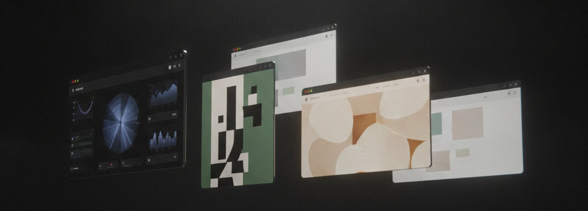
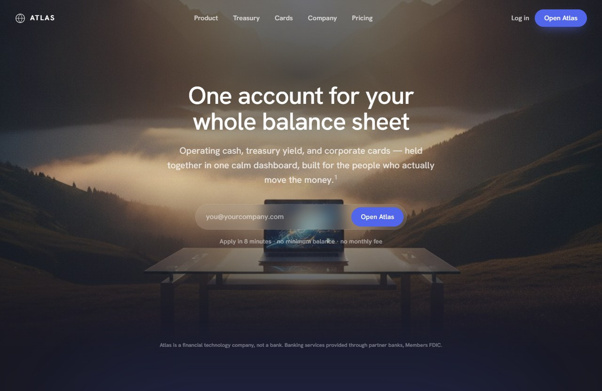
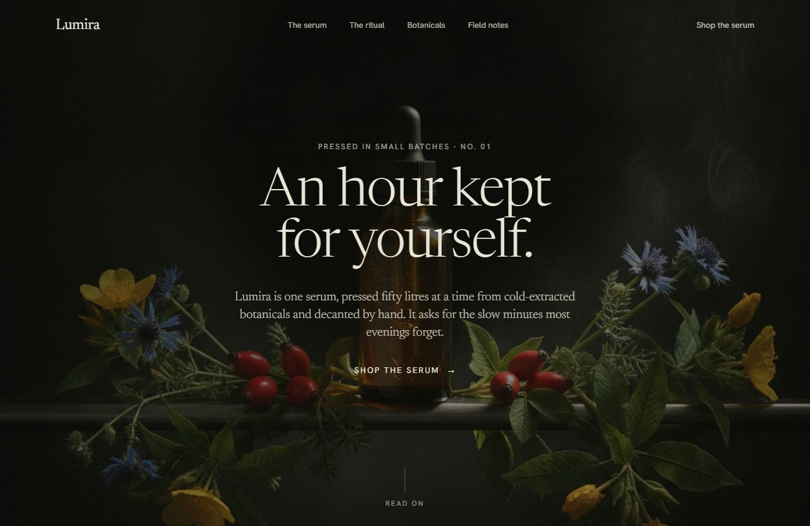
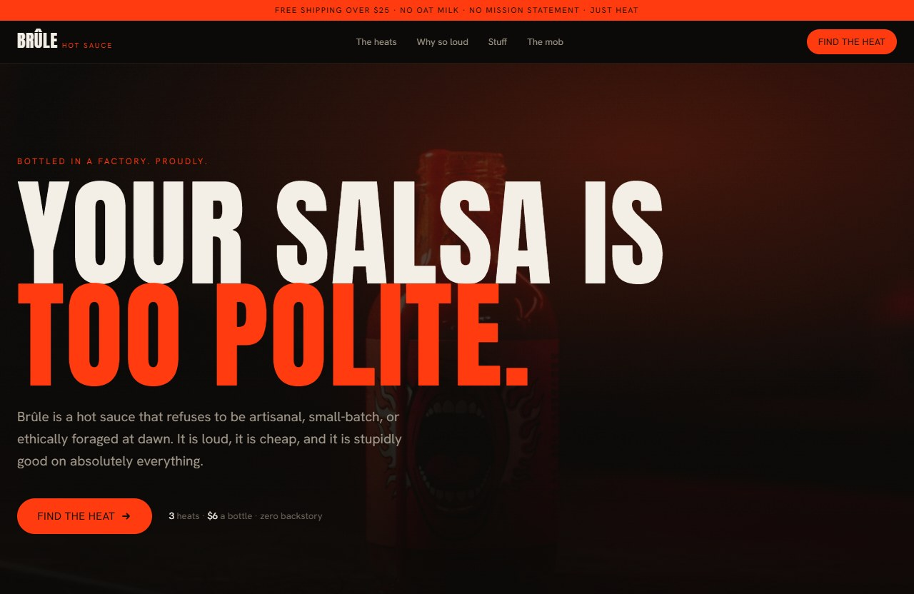
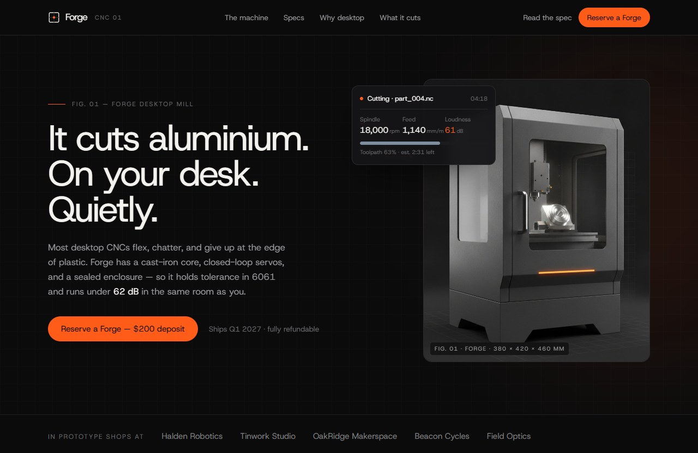
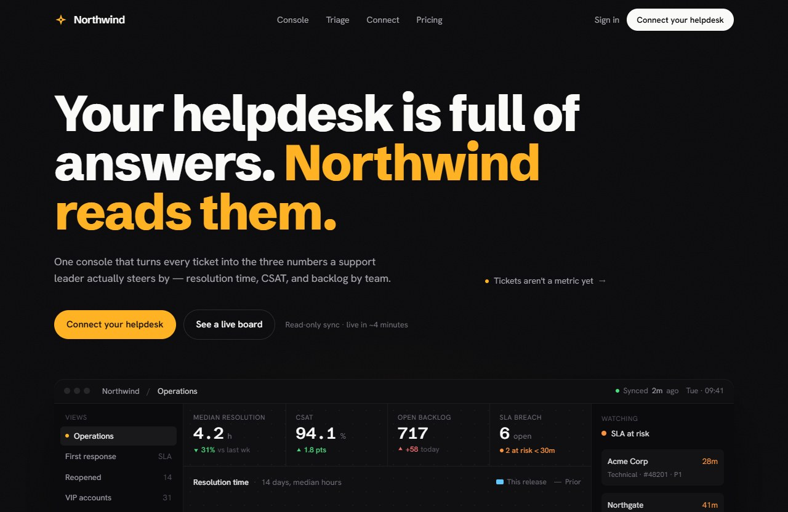
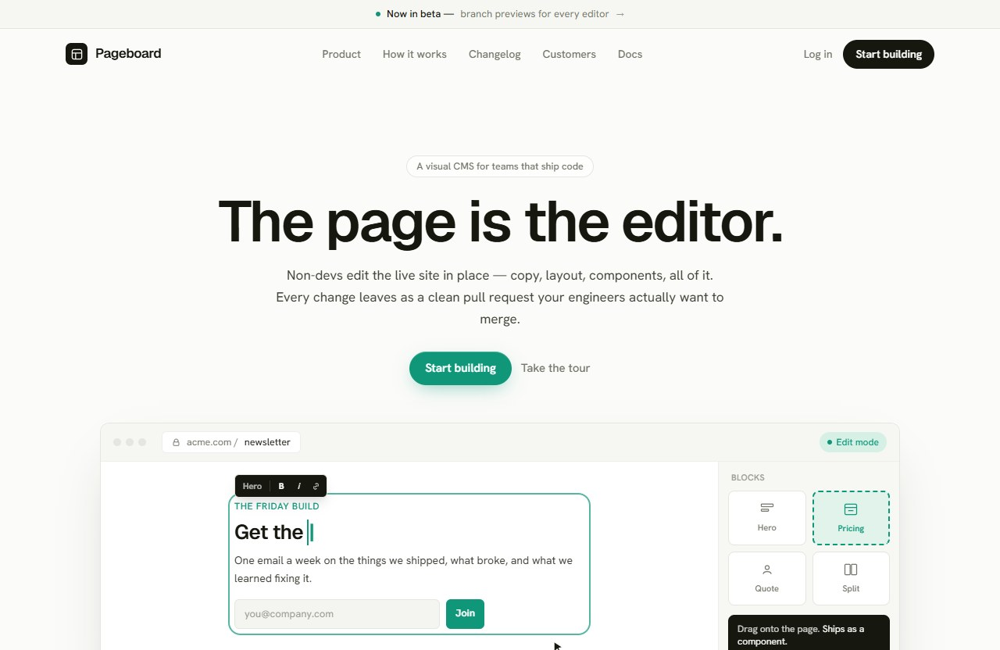
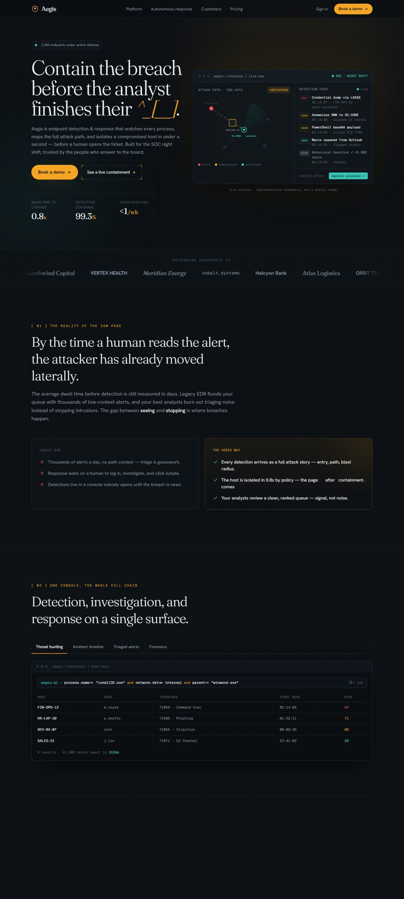
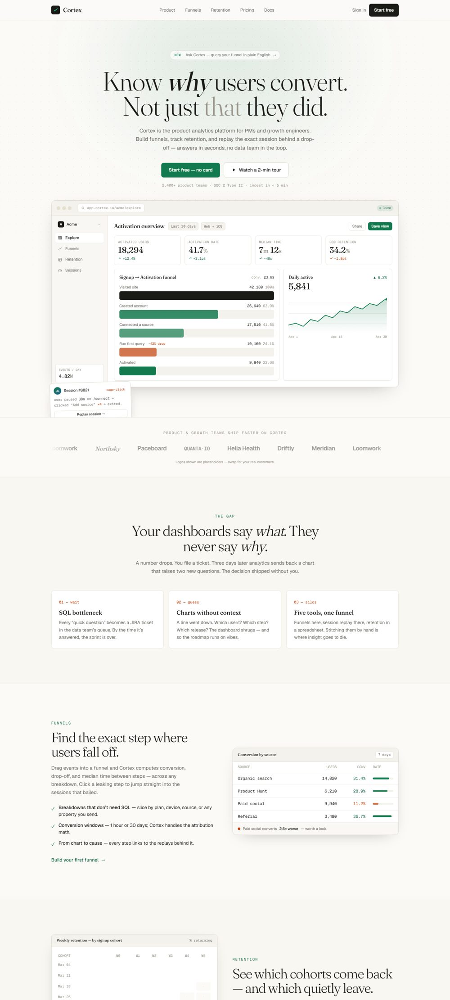
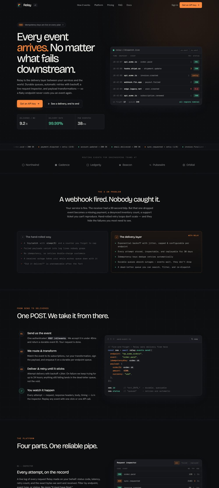

<div align="center">



# Pagewright

**Landing pages de nível design, geradas — não templadas.**

Uma skill para o [Claude Code](https://claude.com/claude-code) que transforma um brief de uma linha numa
landing page original e moderna — HTML + Tailwind estáticos, abre em qualquer navegador.
Feita pra fazer a única coisa que as ferramentas de "site com IA" erram: *não parecer genérica.*

</div>

---

## Galeria

<table>
<tr>
<td width="33%"><br/><sub><b>Atlas</b> — tesouraria & banking</sub></td>
<td width="33%"><br/><sub><b>Lumira</b> — skincare botânico</sub></td>
<td width="33%"><br/><sub><b>Brûle</b> — molho picante</sub></td>
</tr>
<tr>
<td><br/><sub><b>Forge</b> — CNC de mesa</sub></td>
<td><br/><sub><b>Northwind</b> — analytics de suporte</sub></td>
<td><br/><sub><b>Pageboard</b> — CMS visual</sub></td>
</tr>
<tr>
<td><br/><sub><b>Aegis</b> — segurança EDR</sub></td>
<td><br/><sub><b>Cortex</b> — analytics de produto</sub></td>
<td><br/><sub><b>Relay</b> — entrega de webhooks</sub></td>
</tr>
</table>

<sub>Cada uma a partir de um brief de uma linha. Abra qualquer <a href="examples/"><code>examples/&lt;nome&gt;/index.html</code></a> no navegador.</sub>

---

## Como ela escapa do "slop"

🎯 **Ancora em UMA página real** — roteia o seu nicho para uma biblioteca curada de **267 sites reais** (com capturas de página inteira) e copia a estrutura *de verdade*, não a média do modelo.

🛠️ **Constrói o produto em HTML/CSS** — dashboards, tabelas, gráficos, código, à mão como Linear, Stripe e Attio fazem. Objetos físicos e fotografia são gerados (Gemini) ou buscados (Unsplash).

🎨 **Combate a convergência** — atribuição por build de arquétipo de página, tipografia, cor e micro-gramática, para que duas páginas nunca rimem.

## Instalação

```bash
cp -r pagewright ~/.claude/skills/pagewright
```

Depois é só descrever um produto:

> Cria uma landing page para a **Atlas**, uma plataforma de tesouraria e banking para startups.

Ela pergunta se você quer guiar o visual ou se ela mesma decide, e entrega uma página completa e funcional.

## Licença

[MIT](LICENSE) · os thumbnails de referência pertencem aos seus respectivos donos.
