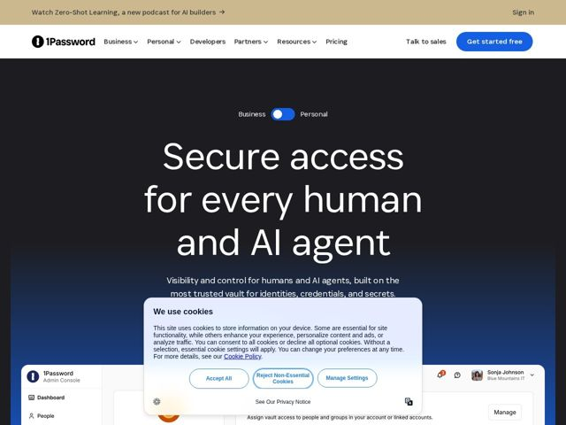

# 1Password — https://1password.com

- **niche:** security
- **mood:** technical-dark
- **style:** dark, minimal, mono-type, cinematic
- **palette:** bg `#0E1116` · ink `#FFFFFF` · accent `#2E6BE6` — primary CTA button (Get started free), the Business/Personal toggle switch, and the deep blue gradient wash that bleeds up from the product screenshot at the bottom of the hero
- **type:** display *Plus Jakarta Sans / geometric humanist sans (very large, light weight)* · body *same family at regular weight, slightly looser tracking* — Calm and editorial, not enterprise-aggressive. The oversized lightweight headline reads almost like a magazine cover rather than a security vendor, signaling confidence through restraint.
- **sections:** topbar-announcement › hero › feature-discover-secure-audit › problem-security-has-to-keep-up › feature-modern-access-control › feature-govern-credentials › feature-passwords-passkeys › feature-saas-access › stats-ai-sso-shadowit › cta › footer
- **signature:** The audience toggle floating directly above the H1 (Business / Personal switch) that rewrites the whole hero in place — a product-style UI control used as the page's primary navigation, breaking the security-vendor convention of a static fear-based banner.
- **imagery:** A realistic in-product Admin Console UI rendered as the hero centerpiece, sitting on a near-black canvas with a vertical navy-to-black gradient glow rising behind it like a horizon. Real interface chrome (sidebar, avatars, notification badges) rather than abstract 3D locks or shield iconography.
- **copy:** Inclusive, human-first framing that folds AI into the security story rather than weaponizing fear — hero reads "Secure access for every human and AI agent."

**Takeaways (steal as ideas, don't copy):**
- Use an inline audience toggle (Business/Personal) above the headline so one hero serves two segments instead of forcing a path-split landing.
- Set an enormous light-weight headline on pure black and let it breathe — restraint signals authority more than a dense feature grid.
- Lead with a real product screenshot fading up out of a single-color gradient horizon, so the UI itself is the hero visual — no abstract security clip-art.
- Frame stat blocks as tension-builders (88% AI adoption, 70% SSO isn't enough, 52% Shadow IT) to justify the product without doom-mongering.
