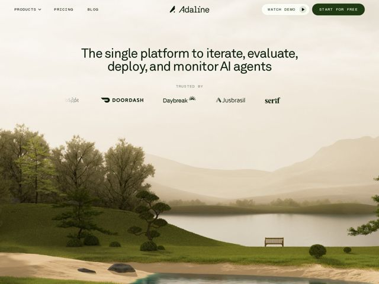

# Adaline — https://adaline.ai

- **niche:** ai
- **mood:** editorial-minimal
- **style:** 3d, minimal, editorial
- **palette:** bg `#EFEBE0` · ink `#1C2419` · accent `#2C4A1E` — CTA em pílula sólida verde-floresta-escuro (START FOR FREE), o botão de play WATCH DEMO, a marca do logo e pequenos glifos de destaque na linha de trusted-by; o verde profundo funciona como o sinal da marca contra o fundo bone quente
- **type:** display *Grotesca geométrica com uma leve sensação quadrada/condensada (na linha de uma Neue Machina ou Sharp Grotesk apertada), composta justa e em bold no h1; o wordmark da marca 'Adaline' é um serif itálico contrastante* · body *Sans-serif neutra e limpa (família Inter / Söhne), labels em small-caps com tracking aberto para eyebrows como TRUSTED BY* — Editorial, composta, discretamente premium — sans condensada em bold pareada com um wordmark serif itálico para uma assinatura literária, quase de revista
- **sections:** hero › logos › problem › feature-speed › feature-security › feature-scale › testimonials › blog-library › cta › footer
- **signature:** Uma paisagem fotorrealista de jardim zen em 3D sob névoa sépia como o fundo full-bleed do hero — uma ferramenta de ops de IA que abre com natureza tranquila em vez de dashboards, gradientes ou grafos de nós.
- **imagery:** Render abstrato-3D fotorrealista de uma serena paisagem de jardim japonês (lago, colinas aparadas, banco solitário, árvores esculpidas) sob uma neblina sépia quente; full-bleed atrás do hero, onírico e calmo em vez de techy — a antítese da típica malha de gradiente de IA.
- **copy:** Pilha de capacidades em linguagem direta como headline — "The single platform to iterate, evaluate, deploy, and monitor AI agents" — os verbos fazem a venda, sem adjetivos de hype, confiante e declarativo.

**Takeaways (roube como ideias, não copie):**
- Reenquadre o trio de pilares de feature como virtudes de uma palavra (Speed / Security / Scale) em vez de nomes de features — substantivos abstratos soam mais confiantes em nível enterprise do que 'logs em tempo real'.
- Pareie um headline em sans geométrica condensada em bold com um wordmark serif itálico contrastante; o logo serif vira o único ornamento da marca contra um sistema tipográfico de resto utilitário.
- Use um fundo bone/aveia quente (#EFEBE0) com um único destaque verde-floresta-profundo — uma paleta abafada, quase terrosa, que sinaliza confiabilidade calma e desvia do clichê do gradiente azul-roxo de IA.
- Deixe uma imagem de hero calmante e não literal (jardim zen, névoa) carregar o registro emocional enquanto o texto se mantém estritamente funcional — clima e mensagem se dividem entre imagem e texto em vez de competir.
