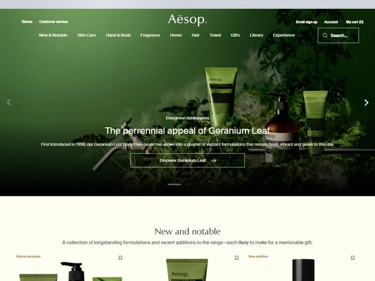

# Aesop — https://www.aesop.com/us/

- **niche:** beauty
- **mood:** premium-luxe
- **style:** photographic, editorial, atmospheric, restrained
- **palette:** bg `#2E3D1E` · ink `#F2F0E6` · accent `#A7B86A` — There is no marketing accent color at all; the "accent" is the verdant geranium green of the photograph itself, and the amber glass of the body-care bottle. Type and CTA stay neutral cream/white so the botanical photo carries every chroma.
- **type:** display *editorial serif (A[ē]sop wordmark + headlines feel like a Times/Caslon-era transitional serif, e.g. Suisse Works or a refined Garamond)* · body *the same serif at small size, generous leading* — Quiet, literary, perfume-counter calm; the serif reads like a printed catalogue, never a webpage.
- **sections:** hero › new-and-notable (product carousel) › range-story › ritual/how-to-use › editorial-feature › store-locator › cta › footer
- **signature:** The entire fold is a single dim, moody studio photograph of three Geranium Leaf products staged on a thin black metal rail amid real geranium foliage and drifting smoke/mist — shot like a still-life painting, not a product page. The headline is centered and laid directly over the dark center of the image with no panel, no scrim, no card; the photo's own falloff to near-black does the legibility work. It reads as a magazine spread that happens to sell things.
- **imagery:** Photography only — a deep-green, low-key botanical still life with theatrical haze, real leaves, and the signature amber apothecary bottle catching the light. No 3D, no illustration, no UI. The treatment is painterly and dim, with the green vignetting to black at the edges.
- **copy:** Literary, evocative, understated luxury. Eyebrow "Evergreen exhilaration"; headline "The perennial appeal of Geranium Leaf"; subhead "First introduced in 1998, our Geranium Leaf Body Care range has grown into a quartet of verdant formulations that remain fresh, vibrant and green to this day." CTA "Discover Geranium Leaf". Section below: "New and notable — A collection of longstanding formulations and recent additions to the range—each likely to make for a memorable gift."

**Takeaways (steal as ideas, don't copy):**
- Let one moody photograph own the whole fold and supply 100% of the color — keep type, nav, and CTA neutral so nothing competes with the image's chroma.
- Set the headline directly on the dark heart of the photo with zero scrim or card; engineer the shot's own falloff-to-black to guarantee legibility.
- Use an editorial serif at both display and body size to make a commerce page feel like a printed catalogue rather than a website.
- Open with an evocative two-word eyebrow ("Evergreen exhilaration") before a calm, descriptive headline — borrow the cadence of magazine copy, not ad copy.
