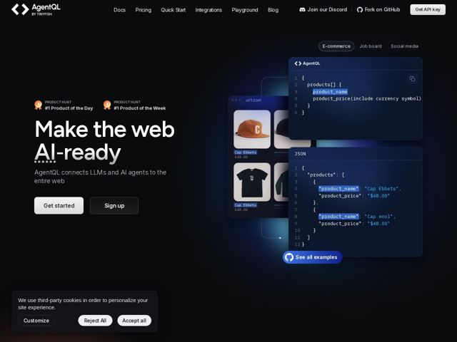

# Agentql — https://agentql.com

- **niche:** dev-tools
- **mood:** technical-dark
- **style:** dark, gradient, 3d, mono-type
- **palette:** bg `#05060A` · ink `#FFFFFF` · accent `#3B6EF6` — pílulas de syntax-highlight nas chaves de query (product_name), o botão 'See all examples', a pílula da aba ativa 'E-commerce' e o glow/bloom atrás dos cards flutuantes de código+produto
- **type:** display *Sans grotesca geométrica (peso pesado, quase preto), p.ex. um estilo Söhne/Neue Haas* · body *A mesma sans humanista em peso regular; monospace para os painéis de código* — Confiante e direta como um engenheiro — headline display preto superdimensionado contra body copy leve, com código monospace como uma voz tipográfica de igual importância
- **sections:** hero › logos › feature-suite-intro › feature-grid › problem › pricing › testimonials › cta › footer
- **signature:** O hero é um tríptico ao vivo de causa-e-efeito: uma página de e-commerce real (cards de produto com chapéus/camisas), uma pequena query AgentQL e o JSON resultante — interligados por linhas pontilhadas de conexão e cor de destaque compartilhada, de forma que você literalmente vê uma página web bagunçada colapsar em dados estruturados limpos. Abas (E-commerce / Job board / Social media) permitem trocar a entrada do demo. Vende o produto mostrando a transformação, não descrevendo-a.
- **imagery:** Sem fotografia ou ilustração — a linguagem visual são cards de UI de vidro flutuantes (um editor de query, um painel de saída JSON, uma vitrine raspada) empilhados em profundidade falso-3D sobre uma tela quase preta com sutil bloom radial azul. Linhas pontilhadas conectam entrada a saída. Syntax highlighting real e botões de copiar fazem o chrome parecer o produto de verdade.
- **copy:** Promessa direta com o resultado primeiro e um trocadilho tipográfico — o hero diz "Make the web AI-ready" (note o "AI" sublinhado por pontos, tratado como erro de digitação/flag de markup), sub: "AgentQL connects LLMs and AI agents to the entire web."

**Takeaways (roube como ideias, não copie):**
- Construa o hero como um tríptico conectado entrada->query->saída com fios pontilhados e uma cor de destaque compartilhada, para que o valor do produto seja demonstrado ao vivo em vez de afirmado.
- Adicione abas de caso de uso (E-commerce / Job board / Social media) acima do demo para deixar os visitantes se autosselecionarem e trocarem os dados do exemplo no lugar.
- Trate os painéis de código/JSON como imagem de hero de primeira classe — syntax highlighting real, botões de copiar, números de linha — em vez de screenshots decorativos.
- Use um headline display geométrico quase preto e superdimensionado contra texto de body leve para um tema escuro austero e confiante de engenheiro; um único destaque azul faz todo o trabalho de realce.
