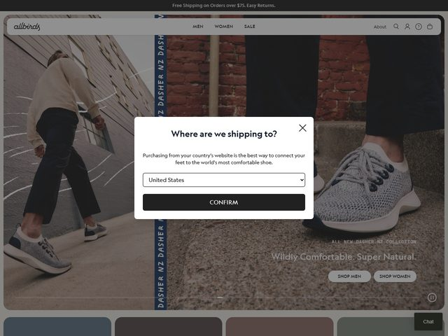

# Allbirds — https://www.allbirds.com

- **niche:** nature
- **mood:** warm-playful
- **style:** photographic, lifestyle, editorial, earthy
- **palette:** bg `#8A8175` · ink `#FFFFFF` · accent `#2E3A6E` — Um índigo-navy abafado vive somente dentro da foto, como o texto vertical repetido "DASHER NZ" no relevo/banner subindo pelo meio-fio; a própria UI evita qualquer cor de marca — os CTAs são pílulas ghost brancas simples, então o navy funciona como uma pista de produto do mundo real, não um destaque de marketing.
- **type:** display *sans humanista, amigável a minúsculas (sensação Apercu / GT Walsheim) para "Wildly Comfortable. Super Natural."* · body *grotesca neutra (Apercu / Inter), nav em small-caps* — Casual, conversacional, de baixo contraste; o logo "allbirds" é composto em um script suave e arredondado que entrega o calor que a tipografia de body não dá.
- **sections:** hero › product-collection-grid › sustainability-our-materials › why-wool-tree story › reviews › cta › footer
- **signature:** Toda a primeira dobra é uma única fotografia de rua edge-to-edge tirada da altura da canela — duas pessoas em pleno passo numa calçada de tijolos ensolarada, pés e tênis no centro do quadro — de modo que a "imagem do hero" é literalmente o produto usado em movimento em vez de encenado sobre branco. O headline "Wildly Comfortable. Super Natural." é discretamente colocado no canto inferior direito em tipografia branca fina, deferindo à foto, e os CTAs são duas pílulas transparentes com contorno branco ("SHOP MEN" / "SHOP WOMEN") em vez de um único botão chamativo.

- **imagery:** Fotografia lifestyle editorial full-bleed — luz natural do dia, modelos reais caminhando recortados a pernas/pés, gradação quente dessaturada em greige e terracota. Sem 3D, sem ilustração; até o produto é mostrado em cena no pavimento. Uma fileira de azulejos abafados com amostras de cor fica ao longo da borda inferior como um teaser da coleção.
- **copy:** Voz lúdica de natureza-encontra-conforto, disposta como duas frases curtas: **"Wildly Comfortable. Super Natural."** com o pequeno rótulo de produto na foto **"ALL NEW DASHER NZ COLLECTION"**. A barra de utilidade diz "Free Shipping on Orders over $75. Easy Returns." A nav é em small-caps lacônico: MEN / WOMEN / SALE.

**Takeaways (roube como ideias, não copie):**
- Fotografe o hero como uma foto de rua full-bleed em ângulo baixo do produto em uso real — venda a experiência de usá-lo, não um packshot sobre branco.
- Deixe o headline sussurrar: tipografia branca fina enfiada num canto, dimensionada para deferir à fotografia em vez de brigar com ela.
- Use pílulas de contorno transparente para CTAs duplos ("SHOP MEN" / "SHOP WOMEN") para que a imagem permaneça o elemento mais chamativo da página.
- Esconda sua cor de marca dentro da fotografia (o texto navy no relevo) em vez de pintá-la sobre a UI, para que o chrome permaneça neutro e o produto continue sendo o hero.
