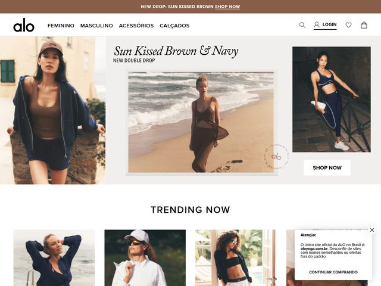

# Alo — https://www.aloyoga.com

- **niche:** fitness
- **mood:** premium-luxe
- **style:** editorial, photographic, minimal, warm-neutral
- **palette:** bg `#FFFFFF` · ink `#1C1A17` · accent `#8A6F55` — Um marrom café/tan quente tirado diretamente do nome da campanha ("Sun Kissed Brown"); ele vive na barra de anúncio do topo e na fotografia arenosa de praia em vez de nos botões. O CTA primário é uma pílula branca simples com tipografia preta, então o marrom funciona como um clima sazonal, não uma cor de UI.
- **type:** display *serif itálico editorial (alto contraste estilo Canela / Ogg)* · body *sans-serif humanista (Neue Haas Grotesk / Helvetica Now)* — Voz de moda de luxo discreto: o headline serif itálico sussurra "campanha", enquanto a nav e os labels em sans permanecem clínicos e pequenos.
- **sections:** hero › trending-now › category-tiles (feminino / masculino) › lookbook-editorial › bestsellers-grid › cta › footer
- **signature:** O hero é construído como um tríptico de três fotografias de moda separadas dispostas lado a lado num palco quase branco — uma modelo de estúdio recortada à esquerda, um quadro de praia centralizado e emoldurado com o headline serif itálico flutuando acima dele, e uma terceira modelo de academia/estúdio à direita. Em vez de uma única imagem de hero full-bleed, lê-se como um spread editorial impresso ou folha de contato, com a pílula SHOP NOW enfiada sob o quadro mais à direita. Um leve carimbo circular de marca d'água "alo" repousa sobre a foto de praia como um crédito de revista.
- **imagery:** Tudo fotografia, sem ilustração ou 3D. Tomadas de lifestyle banhadas de sol e com gradação quente — areia, surfe, paredes de terracota, luz dourada — misturadas com tomadas de produto de activewear em navy mais frio. As modelos são estilizadas como editorial de moda (boné, moletom oversized, cobertura transparente) em vez de em pleno treino, empurrando o vestuário acima da função atlética.
- **copy:** Cadência esparsa de casa de moda. A barra de anúncio em eyebrow diz "NEW DROP: SUN KISSED BROWN — SHOP NOW"; o headline do hero é o serif itálico "Sun Kissed Brown & Navy" com o pequeno kicker "NEW DOUBLE DROP" abaixo dele. Cabeçalho de seção abaixo: "TRENDING NOW". Um pequeno aviso "Atenção" sinaliza a loja oficial brasileira (aloyoga.com.br), confirmando que este é o site localizado BR.

**Takeaways (roube como ideias, não copie):**
- Construa o hero como um tríptico editorial multi-quadro (recortado + emoldurado + recortado) em vez de uma única imagem full-bleed — lê-se instantaneamente como um drop de moda estilizado, não um banner genérico.
- Puxe sua única cor de destaque do próprio nome da campanha/produto ("Sun Kissed Brown") para que a paleta e o texto reforcem uma única ideia sazonal.
- Mantenha o destaque FORA do CTA: uma pílula branca-e-preta simples sob a imagem parece mais boutique do que um botão colorido pareceria.
- Pareie um headline serif itálico de alto contraste com um pequeno kicker em sans all-caps ("NEW DOUBLE DROP") para obter hierarquia de revista de luxo em duas linhas.
