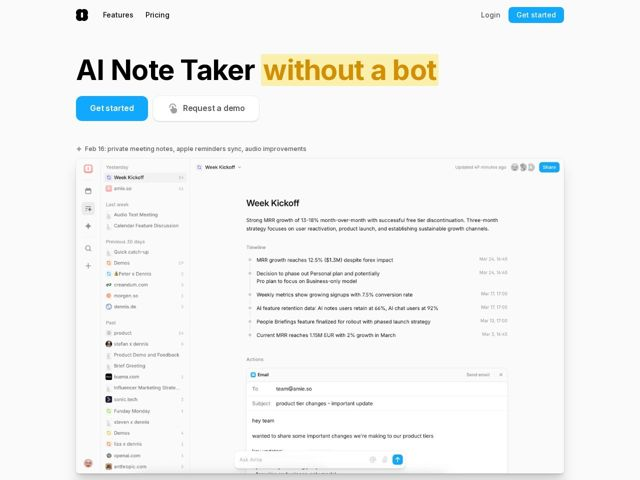

# Amie — https://amie.so

- **niche:** productivity
- **mood:** clean-light
- **style:** minimal, clean, light
- **palette:** bg `#FFFFFF` · ink `#0A0A0A` · accent `#2D7FF9` — Primary CTA button fill (Get started), the in-app Share button, send-message arrow, and the live-app accent chrome; a secondary amber #E8A33D highlight marquees the hero word 'without a bot'
- **type:** display *Inter (heavy/black weight, tight tracking) — likely a custom grotesk in the same family* · body *Inter* — Confident, near-condensed black grotesk for the headline; quiet neutral sans for everything else — startup-modern, dense, no-nonsense
- **sections:** hero › feature-record › feature-organize › feature-automate › cta › footer
- **signature:** A pixel-accurate, fully populated replica of the actual app UI sits directly under the hero — not a hero mockup but a dense, real-looking workspace (sidebar of meetings, a 'Week Kickoff' note with timeline, an inline AI-drafted email, and an 'Ask Amie' composer) — so the product demos itself instead of being described.
- **imagery:** Product-screenshot as hero — a high-fidelity, edge-to-edge rendering of the live app interface with realistic sample data (real MRR figures, dated timeline rows, an email draft). No abstract 3D, illustration, or gradient; the only 'graphic' is the chrome of the product itself, kept bright white with thin gray dividers.
- **copy:** Contrarian one-liner that names the category then subverts it — hero reads 'AI Note Taker without a bot', with the twist phrase amber-highlighted; voice is blunt, anti-hype, positioning-by-negation.

**Takeaways (steal as ideas, don't copy):**
- Highlight the differentiating clause, not the whole headline: marquee just the 3-word twist ('without a bot') in a soft amber swatch so the eye lands on the positioning, not the noun.
- Lead with a populated product surface full of believable data (real-looking MRR numbers, timestamps, an inline email draft) instead of a clean empty mockup — density reads as 'this is a real tool people use'.
- Pair a heavy black condensed-grotesk headline against an otherwise whisper-quiet neutral page so the type does all the loudness and the UI stays calm.
- Use a dated changelog crumb under the CTAs ('Feb 16: private meeting notes, apple reminders sync...') as a low-key liveness signal that the product ships constantly.
