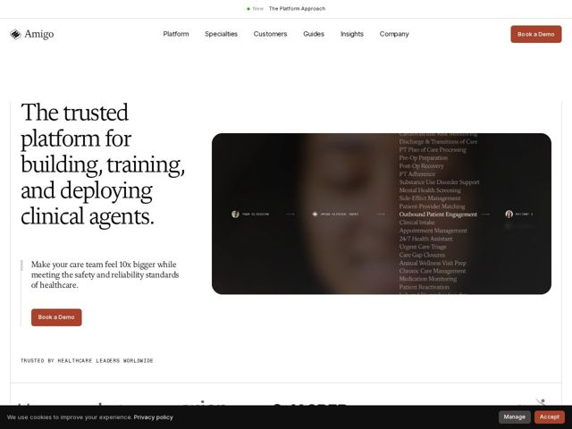

# Amigo — https://amigo.ai

- **niche:** healthcare-ai
- **mood:** editorial-minimal
- **style:** editorial-minimal, photographic, mono-type
- **palette:** bg `#FFFFFF` · ink `#1A1A1A` · accent `#B4502E` — botões de CTA Book a Demo (preenchimento terracota sólido), destaque da barra de citação e o ponto de status 'New' na barra de anúncio
- **type:** display *Serif de alto contraste transitional/de inclinação Didone (p.ex. estilo Newsreader / Source Serif) para o H1 superdimensionado* · body *A mesma família serif em tamanhos menores para o texto de apoio; labels compostos em mono/grotesca em maiúsculas espaçadas* — Literário e clínico ao mesmo tempo — autoridade livresca que lê mais como o cabeçalho de um periódico médico do que uma típica startup de IA
- **sections:** announcement-bar › hero › logos › feature-specialty-workflows › feature-digital-residency › feature-care-model › feature-virtual-patients › feature-security-integration › how-it-works-define › partnership-time-to-value › insights › infrastructure-cta › footer
- **signature:** Um diagrama de fluxo interativo embutido num retrato de paciente escuro e cinematográfico: "Your Clinician → Amigo Clinical Agent → Patient" renderizado como labels mono em small-caps com setas, enquanto um ticker rolando verticalmente com mais de 20 casos de uso clínicos reais (Pre-Op Prep, Care Gap Closures, Urgent Care Triage…) flui ao lado — transformando a imagem do hero num índice de capacidades ao vivo em vez de uma foto estática.
- **imagery:** Um único rosto humano abafado e desfocado (paciente/clínico) esvaecido para quase-preto dentro de um grande retângulo arredondado, usado como uma tela escura para diagramas de sistema em mono-type sobrepostos e uma lista rolante — fotografia como pano de fundo para UI, não como tomada de hero independente.
- **copy:** Benefício em linguagem direta enquadrado na autoridade do serif de periódico. Hero: "The trusted platform for building, training, and deploying clinical agents." O subhead se apoia numa promessa vívida — "Make your care team feel 10x bigger while meeting the safety and reliability standards of healthcare."

**Takeaways (roube como ideias, não copie):**
- Comece com um headline serif estilo Didone superdimensionado para sinalizar confiança/gravidade numa categoria afogada em clones de IA em sans geométrica
- Faça da foto do hero uma tela funcional: sobreponha um diagrama de processo em mono small-caps + uma lista de casos de uso reais que rola automaticamente para que a imagem prove amplitude, não só vibe
- Use um único destaque terracota quente com parcimônia (CTAs + ponto de status) contra branco puro/quase-preto para uma sensação contida e premium-clínica
- Componha micro-labels e linhas de confiança em mono maiúsculo de tracking aberto para contrastar com o serif livresco e ler como 'nível-infraestrutura'
