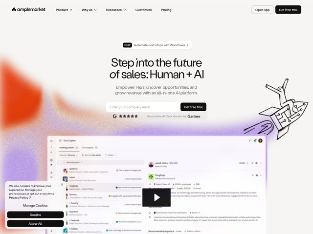

# Amplemarket — https://amplemarket.com

- **niche:** ai-sales / sales-engagement (AI SaaS for sales teams)
- **mood:** clean-light
- **style:** minimal, gradient, mono-type
- **palette:** bg `#FFFFFF` · ink `#0A0A0A` · accent `#FF4D1A` — Diffuse orange-to-violet aurora gradient bleeding in from the left edge and around the hero; warms an otherwise white page. Almost no accent on UI chrome — CTAs and nav are pure black.
- **type:** display *Geometric grotesque with a distinctive cursive/script italic swap for emphasis words ('into', 'future'). Tight-set, near-black weight, condensed feel.* · body *Neutral humanist sans (Inter-like), regular weight, muted gray for subheads.* — Confident and editorial — the script-italic accents inside a heavy grotesque headline give it a hand-signed, premium-yet-human tone that nods to the 'Human + AI' thesis.
- **sections:** hero › logos › feature-duo-copilot › feature-grid-platform › how-it-works › feature-personas › testimonials › blog-comparison-content › testimonials-social › cta › footer
- **signature:** The hero headline mixes a heavy geometric grotesque with flowing cursive-script italics on the emotive words ('into the future') — a literal typographic embodiment of the 'Human + AI' tagline, breaking the all-uppercase-sans convention of AI/dev tooling.
- **imagery:** Two visual registers collide: (1) a soft, painterly aurora gradient (orange→pink→violet) smeared across the left/background like spray paint, and (2) a hand-drawn, technical pen-and-ink rocket sketch floating mid-page. Beneath, a high-fidelity product UI screenshot (Duo Copilot inbox/agent view) anchors credibility. The mix of loose illustration + crisp gradient + real product shot is the texture.
- **copy:** Aspirational-yet-human, hero-framing voice: "Step into the future of sales: Human + AI" — sub: "Empower reps, uncover opportunities, and grow revenue with an all-in-one AI platform." Section copy leans into 'super sales,' 'revenue heroes,' 'superpowers.'

**Takeaways (steal as ideas, don't copy):**
- Encode your product thesis in the typeface itself: swap a script italic into a heavy grotesque headline so the letterforms argue 'Human + AI' before the words do.
- Keep UI chrome monochrome (pure black nav + CTAs) and let a single diffuse painterly gradient carry all the warmth — color lives in the atmosphere, not the buttons.
- Pair loose hand-drawn line illustration (the ink rocket) against a pixel-perfect product screenshot to signal 'crafted by humans, powered by software' simultaneously.
- Embed an inline trust strip directly under the email-capture field (star rating + 'Generative AI Cool Vendor by Gartner') so the proof sits at the exact moment of conversion.
