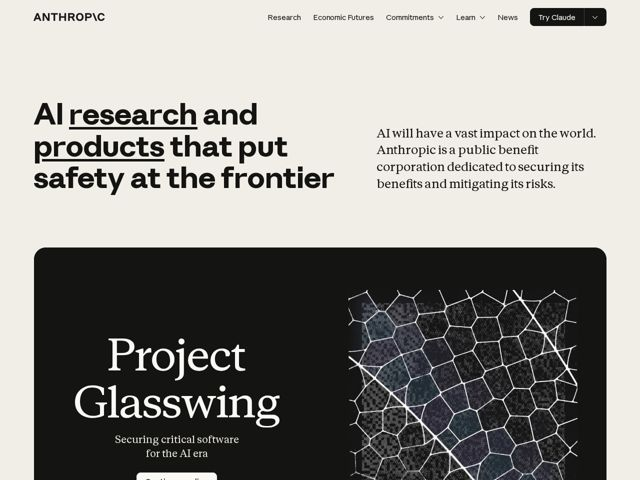

# Anthropic — https://anthropic.com

- **niche:** ai
- **mood:** editorial-minimal
- **style:** editorial, mono-type, minimal
- **palette:** bg `#F0EEE6` · ink `#181818` · accent `#141414` — near-black is the only 'accent' — used in the solid Try Claude pill button, the dark Project Glasswing card, and hand-drawn underlines beneath the words research and products in the hero
- **type:** display *Heavy geometric/grotesk sans for the H1 (chunky, tight-set, near-black weight)* · body *Transitional old-style serif for sub-copy and card titles (Project Glasswing set in a high-contrast serif)* — An intentional grotesk-sans + book-serif clash: industrial confidence in the headline, humanist literary warmth in the prose — feels like a research journal, not a product page
- **sections:** hero › feature-spotlight › feature-latest-releases › mission-statement › footer
- **signature:** Refusing the AI-lab dark/neon trope entirely: a warm paper-cream canvas with a serif body voice and a wordmark that swaps the I for a backslash (ANTHROP\C), reading like an academic press imprint rather than a Silicon Valley AI company
- **imagery:** Almost no photography or product UI above the fold. The single hero visual is a dark card carrying a generative, organic Voronoi/cellular mesh — hand-of-the-machine line work over a dithered texture — signaling 'frontier science' without literal robots or glowing orbs
- **copy:** Mission-first, plainspoken-but-weighty: leads with values over features. Hero: "AI research and products that put safety at the frontier" (research and products underlined for emphasis)

**Takeaways (steal as ideas, don't copy):**
- Pair a heavy grotesk display headline with an old-style serif body to read as 'institution' instead of 'startup' — the tension is the brand
- Use a warm paper-cream (#F0EEE6) instead of white or dark to set a calm, editorial, trustworthy tone in a niche that defaults to black/neon
- Make near-black your only accent: a solid pill CTA, one dark feature card, and hand-drawn underlines carry all the emphasis with zero color
- Replace the obligatory hero screenshot with one abstract generative texture (organic mesh) that signals research depth rather than showing the product
