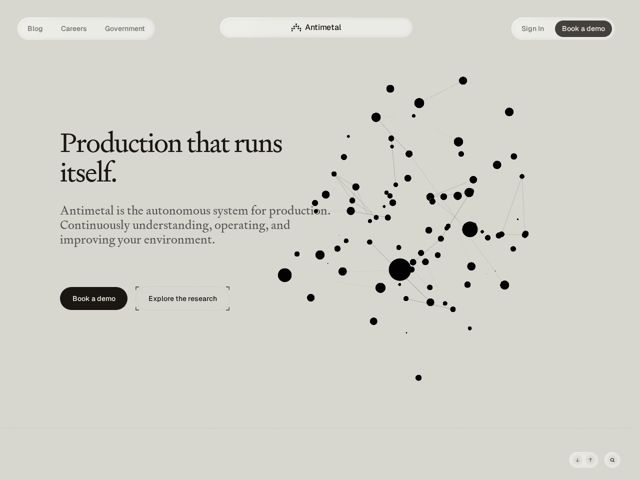

# Antimetal — https://antimetal.com

- **niche:** devops
- **mood:** editorial-minimal
- **style:** minimal, mono-type
- **palette:** bg `#D8D6CD` · ink `#1A1A17` · accent `#23201C` — Reservado para o botão primário em pílula 'Book a demo' e o chrome da pílula flutuante de nav ativa; quase monocromático, então o destaque é um carvão quente quase-preto que salta como um CTA sólido preenchido contra o campo de papel quente. O preto também é usado na constelação de pontos do gráfico do hero.
- **type:** display *Um serif de alto contraste transitional/old-style (de inclinação Didone, na linha de Tiempos / Freight Display / Lyon) — brackets afiados, modulação pronunciada de traço grosso-fino* · body *A mesma família serif em tamanho menor para o subhead/body, mantendo a página em uma única tipografia* — Literário, editorial, quase artigo-acadêmico — confiante e silencioso, o oposto da típica ferramenta devops em sans-serif
- **sections:** hero › problem › feature-new-layer › how-it-works › feature-agents-platform › feature-agent-modules › blog-research-log › cta › footer
- **signature:** Uma constelação viva de grafo de rede ocupando toda a metade direita do hero — pontos pretos espalhados de tamanhos variados interligados por finas linhas tênues, evocando um sistema de produção distribuído como um organismo em vez de um screenshot de UI. Lê a promessa da página ('autonomous system for production') como uma abstração visual, não um mockup de dashboard.
- **imagery:** Grafo de rede abstrato-3d / generativo como o motivo do hero: nós pretos + arestas de espessura mínima sobre papel quente, sem chrome de produto, sem gradientes. O tratamento é plano, tinta-sobre-papel, quase diagrama-científico. O resto da página (conforme os cabeçalhos) se apoia em diagramas conceituais da pilha Team→Agents→World Model→Production em vez de screenshots literais do app — mantendo a contenção editorial por toda parte.
- **copy:** Afirmações de produto declarativas, quase de manifesto, em frases simples e confiantes; o headline do hero diz 'Production that runs itself.' com o subhead 'Antimetal is the autonomous system for production. Continuously understanding, operating, and improving your environment.' A voz é calma e autoritária ('Everyone else watches. We operate.').

**Takeaways (roube como ideias, não copie):**
- Componha a página inteira em um único serif de alto contraste — usar uma Didone editorial para um produto de devops/infra sinaliza imediatamente 'isto é de nível-pesquisa, não mais um SaaS de dashboard' e diferencia numa categoria saturada de sans.
- Faça a nav flutuar como cápsulas-pílula arredondadas e discretas (grupo de links à esquerda, cápsula de logo centralizada, grupo de CTA à direita) pairando sobre o papel em vez de uma barra de largura total — dá uma sensação suave, app-like, quase de toolbar de OS.
- Renderize seu conceito central como um grafo de nós generativo em vez de um screenshot: pontos-e-linhas-finas sobre um fundo neutro quente abstratamente 'mostram o produto' enquanto se mantêm misteriosos e apropriáveis.
- Papel off-white quente (#D8D6CD) mais tinta quase-preta, com o destaque gasto inteiramente em UM único CTA preenchido em pílula — a contenção extrema faz do único botão escuro o único lugar para onde o olho é puxado a clicar.
- Use um CTA secundário de estado misto: o botão 'Explore the research' fica dentro de um frame tracejado/com cantos-em-colchete (um marcador de blueprint) ao lado do primário sólido — pareia visualmente uma ação de 'comprometer' com uma ação de 'investigar'.
