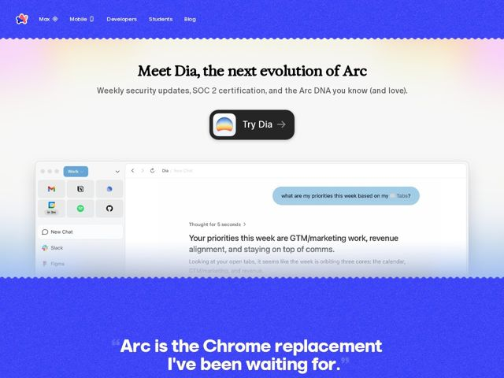

# Arc — https://arc.net

- **niche:** consumer (browser / productivity software)
- **mood:** warm-playful
- **style:** colorful, gradient, photographic
- **palette:** bg `#F4F1F7` · ink `#1A1A2E` · accent `#3D3DF5` — Barra de cabeçalho azul-elétrico full-bleed e uma segunda faixa azul mais abaixo que segura a gigante pull-quote branca; também a pílula escura de CTA Try Dia ancorada no centro do palco
- **type:** display *Marlin Soft SQ* · body *Space Mono* — Display em serif/sans humanista arredondado-porém-quadrado, em bold e com caráter real (sensação de ligadura em 'Meet Dia') pareado contra uma monospace nerd para o body — calor de software amigável cruzado com credibilidade de terminal
- **sections:** hero › feature-product-demo › testimonial-pullquote
- **signature:** As bordas rasgadas/zigue-zague em deckle que fatiam entre cada faixa de cor — a página é cortada como papel cartão em vez de empilhada em seções retangulares limpas, transformando as transições de seção num gesto tátil de scrapbook em vez das divisórias planas que todo site de browser/SaaS usa
- **imagery:** Um screenshot realista de UI de produto, com sombra suave (o browser de chat Dia), flutuando sobre um gradiente pastel-pálido-para-branco; o chrome é mostrado no meio de uma conversa com uma pergunta e resposta reais, de modo que a imagem funciona também como o demo. Os fundos se apoiam em lavagens arejadas pastel-arco-íris contra blocos cobalto saturados
- **copy:** Voz de endosso confiante, humana, em primeira pessoa — começa com uma revelação de produto voltada ao futuro ("Meet Dia, the next evolution of Arc") e fecha numa citação-herói de credibilidade emprestada: "Arc is the Chrome replacement I've been waiting for."

**Takeaways (roube como ideias, não copie):**
- Use bordas de papel-rasgado / zigue-zague em deckle como divisórias de seção para fazer uma página digital parecer feita à mão e tátil em vez de baseada em grade
- Pareie uma face display arredondada e quente com um body em monospace fria — o atrito entre amigável e técnico lê-se como 'software feito com alma'
- Renderize um depoimento gigante como o hero de sua própria faixa de cor full-bleed em tipografia display, para que a prova social vire uma peça gráfica central, não um pequeno card cinza
- Deixe o screenshot do produto carregar uma pergunta+resposta ao vivo e específica para que a imagem do demo venda o caso de uso sem um explicativo à parte
