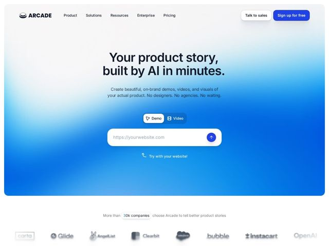

# Arcade — https://arcade.software

- **niche:** dev-tools
- **mood:** clean-light
- **style:** gradient, minimal, clean
- **palette:** bg `#FFFFFF` · ink `#0A0F1C` · accent `#1E4FE0` — Preenchimento do CTA principal (Sign up for free), o banho de gradiente azul-elétrico do hero, o botão circular de seta de envio, o estado ativo do toggle segmentado, e os destaques sublinhados de '30k companies' / links.
- **type:** display *Recoleta (ou similar humanista slab/serif-ish geométrica; display de cantos suaves)* · body *Inter / grotesca neutra sans* — Voz de headline arredondada, amigável e confiante, combinada com um corpo limpo e utilitário — autoridade calorosa, não a frieza corporativa.
- **sections:** hero › logos › feature-formats › feature-ai-brand › feature-speed › how-it-works › feature-gtm-roles › integrations › testimonials › cta › footer
- **signature:** Um input funcional do produto embutido diretamente no hero: um toggle Demo/Video acima de um campo 'https://yourwebsite.com' com uma seta de envio brilhante — a página deixa você experimentar o produto (colar uma URL) antes de rolar, transformando a headline em uma demo interativa em vez de um botão-para-cadastro.
- **imagery:** Gradiente em malha como a linguagem visual principal do hero: um suave florescer radial de branco para azul-elétrico que inunda a partir do canto inferior esquerdo, emoldurado dentro de um grande 'card' retangular de cantos arredondados que flutua sobre o branco. Nenhum screenshot do produto no topo — o gradiente e o input ao vivo SÃO a imagem. O mural de logos renderiza as marcas parceiras em escala de cinza dessaturada para uma credibilidade tranquila.
- **copy:** Voz que prioriza o resultado, com a IA-como-atalho, e uma headline serifada confiante de duas linhas — 'Your product story, built by AI in minutes.' — seguida de um subtítulo de tripla negação ('No designers. No agencies. No waiting.') que nomeia a dor ao apagá-la.

**Takeaways (roube como ideias, não copie):**
- Torne o hero jogável: coloque o input real do produto (aqui um campo de URL + toggle Demo/Video) na primeira dobra para que os visitantes experimentem o valor antes de rolar, em vez de apenas ler sobre ele.
- Contenha o gradiente. Em vez de um fundo azul de sangria completa, pinte a malha radial dentro de um único card gigante de cantos arredondados sobre o branco — a moldura mantém a cor saturada com uma sensação premium e moderna em vez de berrante.
- Use o ritmo de tripla negação no subtítulo ('No designers. No agencies. No waiting.') para definir o produto pelo atrito que ele remove — mais impactante do que listar funcionalidades.
- Organize o miolo da página em torno de personas como H3s paralelos ('Arcade for marketing / sales / customer success / enablement / product') para que cada comprador de GTM se autosselecione sem páginas separadas.
