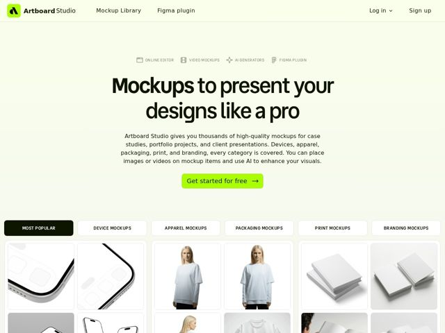

# Artboard — https://artboard.studio

- **niche:** design
- **mood:** clean-light
- **style:** minimal, mono-type, bento, photographic
- **palette:** bg `#F4F8E8` · ink `#141414` · accent `#C6F542` — logo mark, primary CTA button fill, and brand highlights against the pale wash
- **type:** display *Heavy grotesque sans (Inter/Söhne-style black weight, very tight tracking)* · body *Neutral humanist sans (Inter-like), regular weight, generous line-height* — Confident and editorial: an oversized ultra-bold display headline sets a poster-like tone, balanced by quiet, readable body text and tiny uppercase eyebrow labels
- **sections:** nav › hero › feature-tabs › gallery-grid › feature-iphone › feature-tshirt › feature-book › feature-poster › feature-businesscard › feature-box › feature-laptop › feature-desktop › feature-categories › cta › footer
- **signature:** The product showcase IS the page: instead of marketing screenshots, the hero pours straight into a live filterable grid of all-white, neutral product mockups (devices, apparel, packaging) shot like a catalog — the empty-template aesthetic becomes the brand, inviting you to imagine your own art dropped in.
- **imagery:** Studio-lit, blank-white 3D product renders (iPhones, tees, books, posters) floating on soft neutral cards in a bento-style grid; deliberately content-free so the mockups read as canvases. Crisp shadows, no color, no props — pure form against the pale-green wash.
- **copy:** Plainspoken benefit-first claim in a huge poster headline — hero: "Mockups to present your designs like a pro" — followed by a dense, concrete capabilities paragraph (no fluff, lists actual categories).

**Takeaways (steal as ideas, don't copy):**
- Pick an unexpected base canvas — a barely-tinted lime-cream wash instead of pure white — so the page feels designed without using color anywhere else.
- Let one acid-green accent do ALL the work: logo, single CTA, nothing else. Scarcity makes the highlight pop harder than a full palette.
- Turn your product catalog into the hero: a filterable tab bar (Most Popular / Device / Apparel / Packaging) sitting directly under the fold lets users browse the actual goods as the primary selling moment.
- Set a genuinely oversized black grotesque headline at poster scale with tight tracking, then keep everything else whisper-quiet — the contrast alone signals craft.
