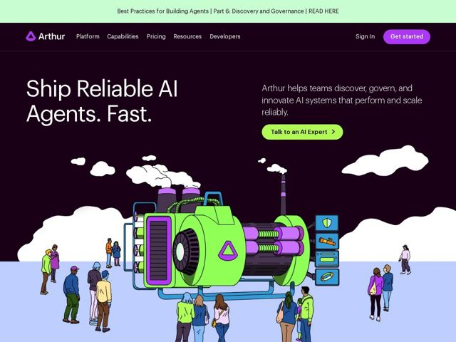

# Arthur — https://arthur.ai

- **niche:** ai
- **mood:** bold-loud
- **style:** illustrated, colorful, dark
- **palette:** bg `#2B0A2E` · ink `#FFFFFF` · accent `#7FE03A` — a máquina da ilustração do hero, a pílula verde-escura do botão 'Get started', e o símbolo triangular do logo
- **type:** display *Grotesca sans (neo-grotesca estilo Helvetica/Arial, peso pesado)* · body *A mesma grotesca sans, peso regular* — Confiança industrial e direta — sem serifas, sem floreios, uma headline apertada que deixa a ilustração carregar a personalidade
- **sections:** banner › hero › feature-lifecycle-platform › feature-evaluate-performance › feature-agent-discovery-governance › feature-guardrails › feature-model-support › feature-deployment › feature-engine-toolkit › logos › problem-stat › blog › studio › values-cta › footer
- **signature:** Uma ilustração desenhada à mão, no estilo de história em quadrinhos, de uma máquina industrial gigante em lima e roxo sendo operada por uma multidão de pessoas diversas — substituindo o clichê do gradiente abstrato / render 3D que quase toda startup de governança de IA adota por padrão. A página trata a IA como uma máquina de fábrica literal e tangível.
- **imagery:** Ilustração vetorial editorial com contornos de tinta visíveis, preenchimentos chapados, nuvens e chaminés de desenho animado. Uma única grande cena do hero (pessoas + máquina sobre um chão azul-pastel contra um céu berinjela profundo) faz o trabalho pesado; a tecnologia é antropomorfizada como infraestrutura física em vez de ser mostrada como screenshots de UI.
- **copy:** Fragmentos imperativos diretos com pontos finais marcantes para criar ritmo; confiante e orientado a resultado. Hero: "Ship Reliable AI Agents. Fast."

**Takeaways (roube como ideias, não copie):**
- Pontue uma headline curta como fragmentos em staccato ('Ship Reliable AI Agents. Fast.') para que cada palavra aterrisse como uma promessa separada.
- Antropomorfize o produto abstrato como uma ilustração literal de máquina + multidão humana para escapar da mesmice do gradiente-de-IA e sinalizar 'as pessoas seguem no controle'.
- Combine um céu berinjela quase preto com um único acento lima de alta-voltagem para que a ilustração brilhe sem uma paleta atravancada.
- Inicie uma seção de problema com uma estatística concreta e contrária ('Only 25% of AI projects return investment.') para justificar o produto inteiro.
