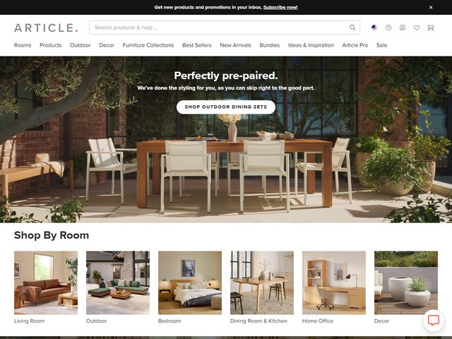

# Article — https://www.article.com

- **niche:** home
- **mood:** warm-playful
- **style:** photographic, editorial, lifestyle, warm
- **palette:** bg `#FFFFFF` · ink `#2B2A28` · accent `#000000` — There is no marketing color; the only "accent" is the all-caps black pill CTA and the thin black top promo bar. The real color comes entirely from the photograph (warm terracotta brick, teak, sun-bleached cream). UI chrome stays neutral so the room does the talking.
- **type:** display *editorial high-contrast serif (Canela / Tiempos Headline feel), centered, modest size* · body *humanist sans (Graphik / Aktiv Grotesk), tight all-caps in nav and CTA* — Calm catalog-editor voice; a quiet serif headline floating over photography rather than shouting.
- **sections:** hero › shop-by-room › new-arrivals › collections › ideas-&-inspiration › best-sellers › cta › footer
- **signature:** The headline and CTA sit dead-center, low in the frame, directly on a full-bleed lifestyle photo of a real styled outdoor dining scene — no gradient scrim, no text box, just white serif type trusting the photo's own dark window-glass behind it for contrast. Immediately below the fold the page hands the wheel to the visitor with a six-up "Shop By Room" thumbnail rail (Living Room, Outdoor, Bedroom, Dining Room & Kitchen, Home Office, Decor), so the hero sells a mood and the very next strip sells navigation.
- **imagery:** Photography only — warm, naturally-lit interior/exterior staging shot like a furniture editorial spread. Teak table, sling chairs, brick patio, olive-tree foliage and a stoneware planter, late-day side light. The category tiles below are softly rounded mini-room photos, reinforcing a "browse by space" mental model.
- **copy:** Soft, helpful, almost concierge — eyebrow promo "Get new products and promotions in your inbox. Subscribe now!", headline "Perfectly pre-paired.", subhead "We've done the styling for you, so you can skip right to the good part.", CTA "SHOP OUTDOOR DINING SETS".

**Takeaways (steal as ideas, don't copy):**
- Drop a quiet serif headline straight onto the darkest region of a lifestyle photo (here, the shadowed window glass) instead of adding a scrim — let composition, not overlays, create legibility.
- Pair an aspirational mood hero with an immediate "shop by room/category" thumbnail rail so the first scroll converts browsing intent into navigation.
- Keep all UI chrome strictly neutral (black/white/gray) and let the product photography supply 100% of the palette — the rooms read as the brand color.
- Use benefit-led, conversational microcopy ("We've done the styling for you, so you can skip right to the good part") to reframe a generic product shot as a curated convenience.
