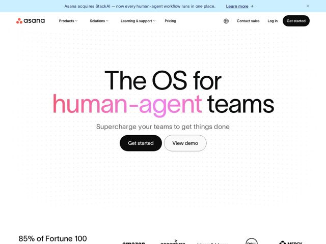

# Asana — https://asana.com

- **niche:** productivity
- **mood:** clean-light
- **style:** minimal, gradient, mono-type
- **palette:** bg `#FFFFFF` · ink `#1A1A1A` · accent `#F06A6A` — gradiente de rosa-quente para magenta na palavra-chave do hero ('human-agent'), o símbolo coral do logo, e a tinta da barra de anúncio
- **type:** display *TWK Lausanne / grotesca geométrica sans* · body *TWK Lausanne (mesma família, pesos mais leves)* — Uma única família humanista-grotesca calorosa por toda a página; o peso display arejado e de tamanho exagerado se lê confiante e editorial em vez de corporativo
- **sections:** announcement-bar › hero › logos › feature-ai-teammates › feature-team-scale › feature-productivity › how-it-works › testimonials › feature-platform-scale › cta › footer
- **signature:** A headline do hero mistura tintas no meio da frase: preto nas palavras de moldura ("The OS for ... teams") mas apenas a expressão conceitual "human-agent" recebe um gradiente de rosa para magenta — usando a cor como um marcador semântico sobre uma única locução nominal em vez de estilizar a headline inteira.
- **imagery:** Quase sem imagem acima da dobra: uma textura tênue de grade de pontos preenche a vasta tela branca em vez de um screenshot de produto ou ilustração. A confiança é carregada por logos corporativos monocromáticos (Amazon, Accenture, J&J, Dell, Merck) e uma estatística marcante "85% of Fortune 100" em vez de visuais de hero.
- **copy:** Voz declarativa que define categoria — reivindica uma nova classe de produto. Hero: "The OS for human-agent teams" com subtítulo "Supercharge your teams to get things done".

**Takeaways (roube como ideias, não copie):**
- Use a cor em gradiente como um marcador semântico sobre UM substantivo na headline, deixando o resto em tinta lisa — isso direciona o olhar para o seu posicionamento, não é só decoração.
- Troque o screenshot do hero por espaço em branco radical + uma tênue grade de pontos; deixe uma headline exagerada de 3 linhas e uma única estatística ('85% of Fortune 100') fazerem a venda.
- Combine um botão de pílula principal preto puro com um secundário fantasma/contornado logo ao lado — CTAs monocromáticos de alto contraste contra uma palavra de acento colorida.
- Enquadre o seu produto como um 'OS for [nova categoria]' para reivindicar uma altitude mais alta do que os concorrentes de lista-de-funcionalidades.
