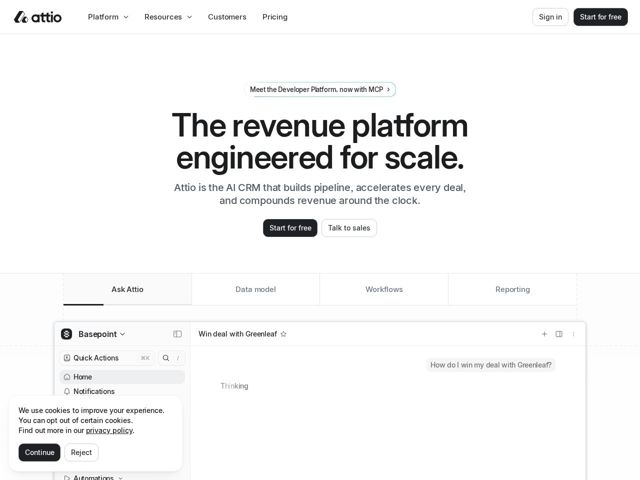

# Attio — https://attio.com

- **niche:** crm
- **mood:** editorial-minimal
- **style:** minimal, clean, mono-type
- **palette:** bg `#FFFFFF` · ink `#1A1A1A` · accent `#0A0A0A` — Near-black fills on the primary CTA buttons (Start for free, top-right nav button) and the active tab underline; the brand color is restraint itself — accent is essentially black-on-white, with the only chromatic note being the subtle blue logo mark.
- **type:** display *Custom grotesque sans (Attio's proprietary face; reads like a tightened Söhne / Neue Haas Grotesk)* · body *Same grotesque family at lighter weight, with monospace numeric labels ([01] [02] [03]) on section markers* — Engineered, editorial, confident — tight tracking, big optical sizes, heavy-to-light contrast
- **sections:** hero › feature-tabs-product-demo › feature-powerful-platform › feature-adaptive-model › feature-data-enrichment › feature-built-for-scale › feature-enterprise-ready › pricing-trial-cta › cta › footer
- **signature:** An interactive tabbed product window pinned right beneath the hero that swaps the live app screenshot in place — selling the CRM by letting you flip through its actual surfaces.
- **imagery:** Product-screenshot-led: real, high-fidelity UI of the app (sidebar nav, "Win deal with Greenleaf" record, an "Ask Attio" AI chat panel mid-"Thinking") shown in a clean floating browser frame with tabbed feature switching (Ask Attio / Data model / Workflows / Reporting) directly under the hero. No abstract 3D or stock photography — the software is the visual.
- **copy:** Outcome-as-product noun phrasing in a tight, declarative voice. Hero: "The revenue platform engineered for scale." Subhead reframes the category: "Attio is the AI CRM that builds pipeline, accelerates every deal, and compounds revenue around the clock."

**Takeaways (steal as ideas, don't copy):**
- Number your feature sections with mono-type section markers ([01] Powerful platform, [02] Adaptive model, [03] data enrichment, [04] Built for scale) — turns a feature list into a chaptered, editorial spec sheet.
- Lead with a single oversized two-line headline set in near-black on pure white, centered, with massive vertical whitespace above it — let the type and air carry the hero, no background graphic.
- Put a tabbed live-app frame immediately under the hero so the product demos itself; tabs (Ask / Data / Workflows / Reporting) let one component show four surfaces without scrolling.
- Coin and trademark a proprietary concept ('Universal Context (TM)') as an h3 to make a generic CRM feature feel like owned IP.
