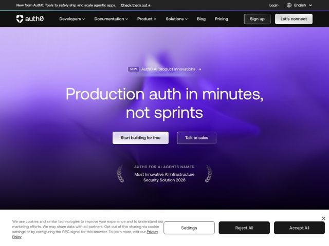

# Auth0 — https://auth0.com

- **niche:** dev-tools (identity / auth infrastructure)
- **mood:** technical-dark
- **style:** dark, gradient, cinematic, mono-type
- **palette:** bg `#0B0614` · ink `#FFFFFF` · accent `#7C4DFF` — Gradiente de nebulosa roxa de sangria completa banhando o hero inteiro do violeta (topo) ao quase-preto (base); também tinge o gradiente do CTA principal e a pílula 'NEW'
- **type:** display *Aeonik (grotesca geométrica, usada em peso bem grande para o hero)* · body *Space Grotesk (grotesca com sabor mono para corpo, nav, eyebrows)* — Engenhosa e confiante — letras geométricas largas com uma sensação levemente técnica, próxima de terminal; calorosa o suficiente para evitar a frieza
- **sections:** topbar-announcement › nav › hero › value-prop › feature-grid › feature-ai-agents › feature-internal-tools › feature-enterprise › feature-signups › logos › resources › cta › footer
- **signature:** O hero descarta o obrigatório bloco de código / screenshot de dashboard das ferramentas de dev por completo e vai totalmente cinematográfico: um gradiente de nebulosa violeta esfumaçada como pano de fundo puramente atmosférico, com nada além de uma enorme tipografia display centralizada flutuando no espaço. Um produto de infra/segurança escolhendo clima e vapor em vez de uma captura de UI do produto é a quebra de gênero.
- **imagery:** Nenhum screenshot de produto, ilustração ou ícone no hero — apenas um campo de gradiente roxo volumétrico desfocado (estética de fumaça/aurora) usado como fundo de sangria completa. A confiança é sinalizada tipograficamente via um lockup de premiação em coroa de louros ('Most Innovative AI Infrastructure Security Solution 2026') renderizado em traços finos gravados em vez de um gráfico de selo.
- **copy:** Posicionamento impactante de empatia com o desenvolvedor que nomeia a dor e o ganho de velocidade; o hero diz "Production auth in minutes, not sprints" (mais adiante na página, apoia-se em "Secure AI agents, humans, and whatever comes next").

**Takeaways (roube como ideias, não copie):**
- Substitua o screenshot de hero padrão das ferramentas de dev por um gradiente atmosférico de sangria completa e deixe a tipografia de tamanho exagerado carregar o quadro inteiro — confiança através da contenção.
- Use um contraste de headline parentético e movido a ritmo ('X in minutes, not sprints') para fazer uma alegação de velocidade soar como um slogan, não uma especificação.
- Renderize prêmios/confiança como uma tipografia fina gravada em coroa de louros em vez de selos plásticos — mantém intacto o clima premium-escuro.
- Combine duas grotescas (display geométrica + corpo com sabor mono) para que a página se leia 'engenhosa' sem recorrer a uma fonte de código literal.
