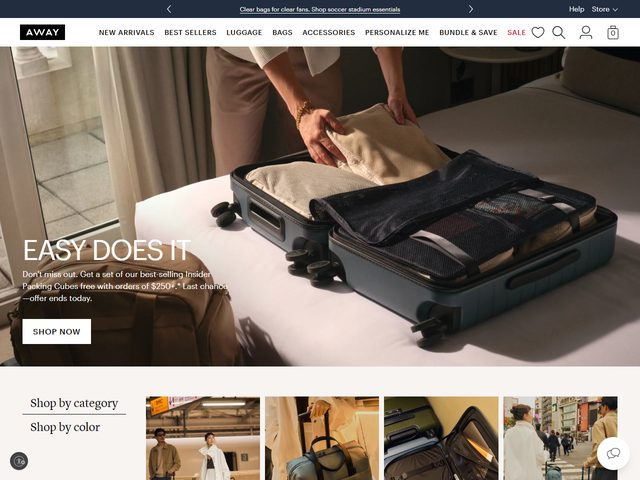

# Away — https://www.awaytravel.com

- **niche:** travel
- **mood:** clean-light
- **style:** photographic, editorial, lifestyle, e-commerce
- **palette:** bg `#FFFFFF` · ink `#1A1A1A` · accent `#D83A34` — Um único vermelho abafado aparece apenas no item de nav "SALE", usado como puro sinal de merchandising; o resto do cromo é estritamente preto-no-branco com uma pequena pílula de wordmark preta.
- **type:** display *grotesca condensada, largura próxima de Druk / Tungsten, caixa alta* · body *humanista neutra sans, p.ex. Neue Haas Grotesk / GT America, pequena e leve* — Confiante e barulhenta de varejo na escala de headline, mas o texto de apoio se mantém quieto e instrutivo.
- **sections:** hero › shop-by-category › shop-by-color › best-sellers › packing-cubes-bundle › travel-stories › cta › footer
- **signature:** O hero é uma fotografia de lifestyle calorosa e naturalista — mãos vistas de cima fazendo a mala numa mala rígida aberta sobre a cama de um hotel, com os organizadores Insider arrumadinhos e empilhados dentro — e a tipografia fica diretamente sobre a imagem, no canto inferior esquerdo, SEM véu ou caixa de sobreposição. A headline branca "EASY DOES IT" se lê apenas contra a sombra suave do lençol. Ela vende o *ritual* de fazer as malas (o momento no quarto), não o produto sobre um fundo de estúdio sem emendas.
- **imagery:** Fotografia de lifestyle editorial de sangria completa com uma paleta interior suave, quente e dourada de fim de tarde (cortinas bege, roupa de cama em taupe, tons de pele). Abaixo da dobra, uma grade de quatro fotos menores de viagem/rua para "Shop by category / color." Sem 3D, sem ilustração — pessoas reais, quartos reais.
- **copy:** Voz urgente de promoção de varejo sob uma headline aspiracional. Headline: "EASY DOES IT." Subtítulo: "Don't miss out. Get a set of our best-selling Insider Packing Cubes free with orders of $250+.* Last chance—offer ends today." Botão de CTA: "SHOP NOW." Barra de anúncio no topo: "Clear bags for clear fans. Shop soccer stadium essentials."

**Takeaways (roube como ideias, não copie):**
- Coloque a tipografia branca da headline diretamente sobre uma foto com uma zona naturalmente escura/suave em vez de adicionar um véu — deixe a iluminação do fotógrafo fazer o trabalho de contraste.
- Fotografe o produto em pleno uso num ambiente real (mãos fazendo a mala sobre a cama) em vez de num fundo de estúdio sem emendas — isso vende o momento, não apenas o objeto.
- Reserve a sua única cor de acento para uma só palavra da nav ("SALE") para que a urgência se leia instantaneamente sem colorir a UI inteira.
- Combine uma headline condensada e evocativa em caixa alta com uma linha de oferta hiperespecífica e movida a prazo logo abaixo para fundir o clima da marca com a conversão.
