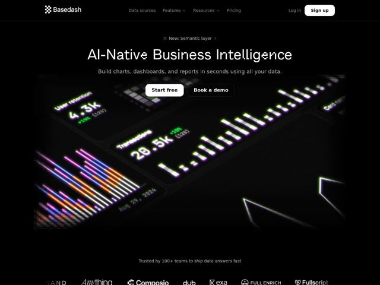

# Basedash — https://basedash.com

- **niche:** ai / data (AI-native business intelligence, dashboards & analytics)
- **mood:** technical-dark
- **style:** dark, mono-type, cinematic, 3d
- **palette:** bg `#000000` · ink `#FFFFFF` · accent `#7CFF5B` — Glowing neon-green metric numbers and +% deltas inside the hero dashboard render; faint phosphor glow on the 3D chart bars
- **type:** display *Pixel/dot-matrix LED-style mono display face (digital-segment styled, used for the H1)* · body *Clean geometric sans-serif (Inter-like) for subhead, nav and body* — Retro-computing terminal meets modern SaaS — the dot-matrix headline reads like a CRT readout while the body stays crisp and contemporary
- **sections:** hero › logos › feature-dashboards-from-prompt › feature-ask-anything › feature-trusted-metrics › feature-all-data-one-place › faq › cta › comparisons › features › resources › footer
- **signature:** The H1 is set in a glowing dot-matrix/LED-segment display typeface — the headline literally looks like a digital dashboard readout, not typeset web text. BI sites almost always lead with a clean sans + a flat product screenshot; here the typography itself impersonates the product.
- **imagery:** A single dramatic 3D hero render: a dark dashboard tilted in perspective into deep space, with phosphor-green metric tiles (User retention 4.3k, Transactions 20.5k) and a forest of glowing extruded bar charts receding toward a vanishing point. Dithered/halftone pixel noise frames the edges, evoking a CRT or low-res sensor. Monochrome logo wall below on pure black.
- **copy:** Confident, plain-spoken product claim with a speed hook — H1 "AI-Native Business Intelligence", sub "Build charts, dashboards, and reports in seconds using all your data."

**Takeaways (steal as ideas, don't copy):**
- Make the headline BE the product: render your H1 in a typeface that mimics what you sell (here, a dashboard LED readout) instead of describing it.
- Tilt the hero product shot into 3D perspective receding to a vanishing point so a flat dashboard reads as cinematic depth rather than a flat screenshot.
- Use a single restrained neon accent (phosphor green) only on the live numbers/deltas so the data itself glows against pure black.
- Frame the render with dithered halftone pixel noise at the edges to evoke a CRT/terminal and tie the imagery to the retro-computing headline.
