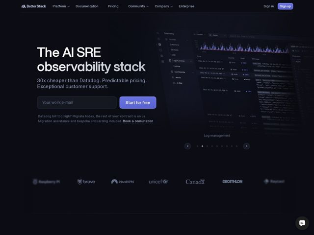

# Betterstack — https://betterstack.com

- **niche:** devops
- **mood:** technical-dark
- **style:** dark, gradient
- **palette:** bg `#0B0B12` · ink `#EDEDF2` · accent `#7C7FF0` — Preenchimento do botão de CTA principal ("Start for free"), a pílula "Sign up" na nav, o ponto ativo do carrossel, o link inline sublinhado ("Book a consultation"), e as barras de dados azuis/selos de log INFO dentro do screenshot do produto
- **type:** display *Grotesca geométrica sans (custom da Better Stack / estilo GT-Walsheim) — larga, de baixo contraste, terminais arredondados, tendências de single-story* · body *Humanista neutra sans (estilo Inter)* — Engenhosa, calma, confiante — display grande e arejado, composto apertado, sem floreio, lê-se como documentação de infraestrutura que decidiu ser bonita
- **sections:** hero › logos › problem › feature-ai-sre › feature-tracing › feature-incident-management › feature-uptime-monitoring › feature-log-management › feature-infrastructure-monitoring › feature-error-tracking › feature-real-user-monitoring › feature-status-page › testimonials › cta › footer
- **signature:** Um único screenshot de produto renderizado em perspectiva 3D dramática — inclinado e recuando para o escuro, sangrando pela borda direita de modo que os densos dados de log/telemetria se dissolvem na sombra. Ele vende a \"profundidade dos dados\" literalmente, e um carrossel de pontos faz ciclar nove superfícies diferentes do produto a partir de um único quadro de hero.
- **imagery:** Screenshot de produto como hero, mas tratado como abstrato-3d: a UI real do dashboard é angulada no espaço-z, sangrada nas bordas e atenuada num gradiente quase-preto de modo que linhas individuais se leem como textura em vez de conteúdo legível. Os logos de clientes ficam numa faixa monocromática acinzentada de baixo contraste abaixo da dobra.
- **copy:** Ataque de valor ancorado no concorrente — nomeie o incumbente e o desbanque. Hero: \"The AI SRE observability stack\" com subtítulo \"30x cheaper than Datadog. Predictable pricing. Exceptional customer support.\"

**Takeaways (roube como ideias, não copie):**
- Ancore o pitch inteiro na dor de um concorrente nomeado: um subtítulo "30x cheaper than Datadog" mais uma linha de microcopy de suborno-de-migração ("the rest of your contract is on us") faz a qualificação que uma proposta de valor genérica não consegue.
- Use um input de captura de email fundido diretamente ao botão de CTA como a ação principal do hero em vez de um botão simples — isso encurta o funil para um único campo no hero escuro.
- Transforme UM screenshot de produto inclinado e sangrado nas bordas em todo o sistema visual: atenue-o no gradiente de fundo para que os dados densos se leiam como textura atmosférica, e então coloque um carrossel de pontos abaixo dele para girar por cada superfície do produto sem adicionar seções.
- Construa a página como uma longa pilha de ~10 blocos de funcionalidades paralelos, cada um rotulado como um SKU de produto (Tracing, Log management, Error tracking), sinalizando amplitude de plataforma — profundidade-por-enumeração em vez de uma única funcionalidade de hero.
