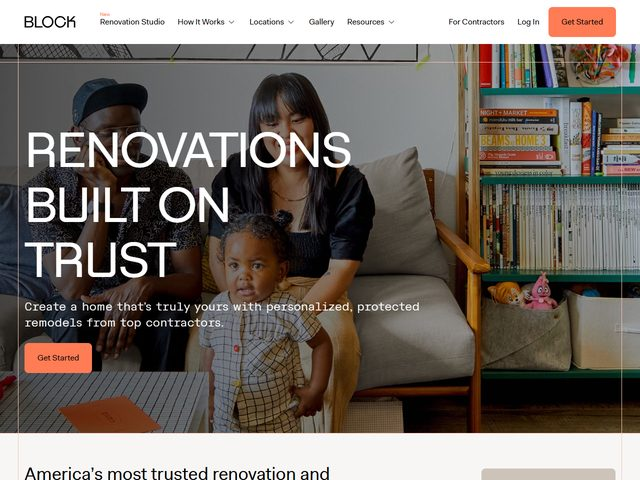

# Block — https://www.blockrenovation.com

- **niche:** home
- **mood:** warm-playful
- **style:** photographic, editorial, lifestyle, warm
- **palette:** bg `#FFFFFF` · ink `#1C1A18` · accent `#E8703A` — A warm terracotta-orange owns both the top-right "Get Started" pill in the nav and the secondary "Get Started" button over the photo, plus a tiny orange "New" eyebrow on the logo; it's the only saturated color against the otherwise neutral photographic frame.
- **type:** display *condensed grotesque, all-caps (think Druk Wide Condensed / Founders Grotesk Condensed)* · body *humanist sans, Sohne or Inter, regular* — Big, blocky, confident headline voice softened by a warm, plain-spoken subhead.
- **sections:** hero › trust-stats › how-it-works › before-after-gallery › contractor-network › locations › testimonials › cta › footer
- **signature:** The headline is set in towering all-caps condensed type laid directly over a candid family photo — a Black family (two parents, a toddler in a checked shirt) relaxing on a sofa beside a teal bookshelf crammed with real cookbooks and a pink toy. There's no overlay scrim, no studio staging: the white "RENOVATIONS BUILT ON TRUST" sits on the genuinely lived-in left half of the room while the busy, colorful shelf anchors the right. It reads like a documentary frame, not a stock render — warmth and trust shown, not claimed.
- **imagery:** Full-bleed editorial lifestyle photography, warm natural light, real domestic mess (books spilling off shelves, a kids' toy, an orange folder on the coffee table). Zero illustration, zero 3D, no product-UI. The photo IS the argument: this is what a finished, loved home actually looks like.
- **copy:** Plain, reassuring, benefit-led. Headline: "RENOVATIONS BUILT ON TRUST." Subhead: "Create a home that's truly yours with personalized, protected remodels from top contractors." A secondary line below the fold begins "America's most trusted renovation and…" Nav eyebrow flags a "New" Renovation Studio.

**Takeaways (steal as ideas, don't copy):**
- Prove "trust" with a candid, un-staged family photo (real clutter, a toddler, lived-in shelving) instead of a glossy showroom render — authenticity does the persuading.
- Set a short three-word claim in towering all-caps condensed type directly on the photo's negative space, no dark scrim, letting the image's own quiet left side carry the type.
- Let a single warm terracotta-orange be your only saturated accent — repeat it across the nav pill, hero CTA, and a tiny "New" tag so the brand color reads instantly.
- Pair a blocky, declarative caps headline with a soft humanist-sans subhead so the page feels both confident and human, not shouty.
