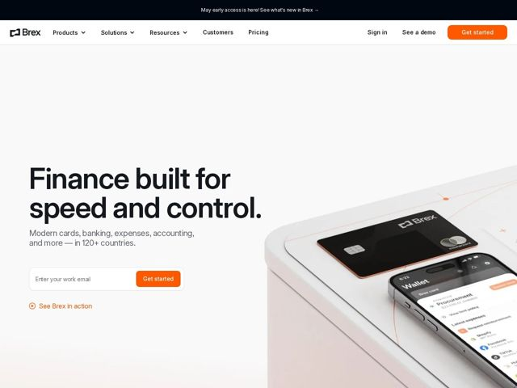

# Brex — https://brex.com

- **niche:** fintech
- **mood:** clean-light
- **style:** minimal, photographic, mono-type
- **palette:** bg `#F2F0ED` · ink `#1A1A1A` · accent `#F25C18` — botão de CTA primário, o link de play 'See Brex in action', o detalhe na borda do cartão físico e uma linha fina de trilha/circuito atravessando a foto do hero
- **type:** display *grotesca/neogrotesca sans (estilo custom 'Brex Sans', à la Söhne/Aktiv Grotesk)* · body *mesma sans humanista-grotesca, peso mais leve, entrelinha generosa* — Confiante e engenheirada — o peso pesado do display com tracking apertado lê como design industrial de produto, não como fintech brincalhona; o título em caixa baixa, terminado em ponto, lhe dá uma autoridade calma e declarativa
- **sections:** topbar-announcement › nav › hero › logos › feature-cards › how-it-works › feature-operations › feature-rewards › resources-insights › footer
- **signature:** O hero abre com uma fotografia de produto tátil e superdimensionada do cartão físico preto repousando sobre uma superfície macia rosa-bege, com um celular real exibindo o app ao vivo — fotografado como um still life de artigo de luxo, com uma tênue linha laranja de trilha de circuito desenhada por cima, em vez do screenshot chapado de dashboard que toda fintech adota por padrão. Hardware como protagonista, não software como protagonista.
- **imagery:** Still life de produto fotorrealista: o cartão Brex de metal preto fosco e um iPhone real rodando a UI da Wallet, posicionados sobre papel sem emenda em tom neutro quente, com sombras suaves de estúdio. Uma única linha vetorial laranja fina cruza a composição como uma trilha de circuito/rota de voo, conectando o objeto físico à UI digital. Tratamento premium, tátil, de catálogo editorial — adereços mínimos, máxima textura de superfície.
- **copy:** Voz declarativa de design de produto, confiante em caixa baixa — promessas curtas lideradas por substantivos e terminadas em ponto. Hero: "Finance built for speed and control." com subhead "Modern cards, banking, expenses, accounting, and more — in 120+ countries."

**Takeaways (roube como ideias, não copie):**
- Abra com o objeto físico como um still life de luxo (cartão real + celular real sobre papel sem emenda em tom quente) em vez de um screenshot chapado de produto — faz uma empresa de software parecer tátil e premium
- Use um off-white quente/greige (#F2F0ED) como base em vez do branco puro clínico; lê como caro e combina com um único acento laranja vibrante usado com parcimônia
- Termine o título grande com um ponto e mantenha-o em caixa baixa e calmo — autoridade declarativa supera o title case cheio de hype na fintech
- Desenhe uma única linha vetorial fina, na cor de acento, atravessando a foto do hero para conectar visualmente o hardware à UI na tela — um recurso barato e replicável que sinaliza 'sistema conectado'
