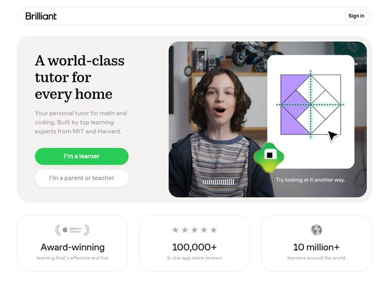

# Brilliant — https://brilliant.org

- **niche:** education
- **mood:** clean-light
- **style:** rounded, friendly, photographic, card-based
- **palette:** bg `#FFFFFF` · ink `#1A1A1A` · accent `#1CC04A` — A bright kelly green reserved for the single primary CTA pill ("I'm a learner") and tiny in-product accent shapes; the secondary CTA is a plain white outlined pill, so the green carries all the "go" weight by itself.
- **type:** display *high-contrast editorial serif (Tiempos / Fenris / Noe Display feel), tight and bookish* · body *humanist sans-serif (Brilliant's own Diatype-ish grotesque), muted gray* — Warm and literate up top, plain and reassuring in the supporting copy.
- **sections:** hero › social-proof-stats › how-it-works-interactive › courses-grid › testimonials › pricing › cta › footer
- **signature:** The hero stages a real photograph of a kid mid-"aha" (mouth open, leaning in) inside a big rounded card, and floats an actual interactive lesson tile over it — a purple pinwheel/square-dissection puzzle with a cursor arrow and the caption "Try looking at it another way." The fold sells the *feeling* of a lesson clicking, not features: a human reaction plus a live-looking interactive sit side by side in one rounded panel.
- **imagery:** Lifestyle photo (warm bedroom/study background, soft natural light) composited with crisp product-UI — the geometry-puzzle widget and a glossy green app-icon blob bridge photo and software. Everything lives in heavily rounded white cards with subtle shadow, giving an approachable, app-store gloss.
- **copy:** Confident, homey, credential-forward. Serif headline "A world-class tutor for every home"; subhead "Your personal tutor for math and coding. Built by top learning experts from MIT and Harvard." CTAs split the audience: "I'm a learner" vs "I'm a parent or teacher." Stats row reads "Award-winning", "100,000+", "10 million+".

**Takeaways (steal as ideas, don't copy):**
- Use a candid human-reaction photo (genuine surprise/delight) as the hero subject instead of a polished product shot — it sells the emotional outcome.
- Overlay a live-looking interactive widget on top of a photo so the product feels playable in the fold, not just described.
- Split the primary CTA by audience ("I'm a learner" / "I'm a parent or teacher") to route two intents from one fold without a menu.
- Pin a thin trust strip ("Award-winning · 100,000+ reviews · 10 million+ learners") directly under the hero as three quiet stat cards.
