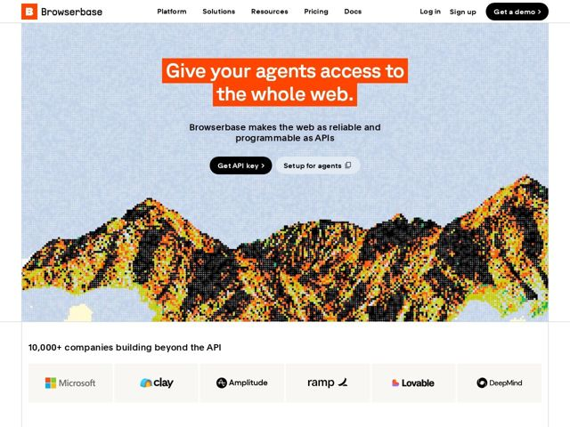

# Browserbase — https://browserbase.com

- **niche:** dev-tools (browser infrastructure / agent automation API)
- **mood:** clean-light
- **style:** minimal, mono-type, photographic
- **palette:** bg `#FFFFFF` · ink `#0A0A0A` · accent `#FF4D1A` — Solid orange highlight block behind the hero headline text (marker-highlighter effect); also bleeds into the dithered mountain artwork as orange/yellow pixels
- **type:** display *Geometric grotesk sans (Browserbase-style, near Aeonik/Founders Grotesk), tight-set and bold* · body *Same neutral grotesk at regular weight; small-caps/uppercase mono accents for section labels* — Engineered and matter-of-fact but warm — heavy weights and tight tracking give confidence without shouting, softened by the playful dithered imagery
- **sections:** nav › hero › logos › feature-showcase › feature-api › feature-capabilities › templates › how-it-works › scale-stats › cta › footer
- **signature:** The hero headline is wrapped in a solid orange highlighter block — like a physical marker swiped across text on white paper — instead of the obligatory dark gradient/glow hero that dev-infra sites default to. It treats the page like a printed zine, not a terminal.
- **imagery:** A large 1-bit / Atkinson-dithered halftone illustration of a mountain range against a flat pale-blue sky — coarse black, orange and yellow pixels rendering rock and foliage. It reads as retro-print / risograph texture rather than 3D renders, abstract gradients, or product UI shots. Imagery is decorative and tonal, not literal product screenshots.
- **copy:** Imperative, agent-centric and slightly cheroic — sells reach and reliability over features. Hero: "Give your agents access to the whole web." with subline "Browserbase makes the web as reliable and programmable as APIs."

**Takeaways (steal as ideas, don't copy):**
- Use a physical highlighter-marker block (solid accent rectangle behind text) to spotlight the hero line — far more memorable than a gradient on a white page.
- Replace the default dev-infra 3D/terminal aesthetic with dithered/risograph halftone art for an analog, zine-like texture that still feels technical.
- Lean on declarative, web-scale verbs in headings ('Don't use the web. Scale it.', 'Watch the whole web at once') to give a B2B API product an almost manifesto voice.
- Pair tightly-set heavy grotesk type with a coarse pixel illustration so the precise type and the rough texture create deliberate tension.
