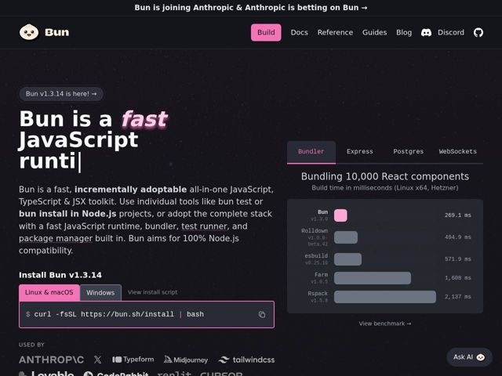

# Bun — https://bun.sh

- **niche:** dev-tools
- **mood:** technical-dark
- **style:** dark, gradient, mono-type
- **palette:** bg `#0B0B0F` · ink `#FBF0DF` · accent `#FF6AC1` — the word 'fast' in the hero, the 'Build' nav pill, the active 'Linux & macOS' tab, the install command border, and the Bun benchmark bar (a pink that nods to the cartoon-bun mascot)
- **type:** display *Geometric grotesque (heavy black weight, with the italicized 'fast' as a slanted accent)* · body *System / Helvetica-like sans for prose; monospace for install command and version labels* — Confident, chunky, a little playful — heavy display weight reads bold and almost toy-like, while mono details keep it credibly technical
- **sections:** announcement-bar › hero › feature-benchmark-tabs › logos › feature-four-tools › testimonials › feature-whats-different › feature-runtime › feature-package-manager › feature-test-runner › feature-apis › how-it-works › testimonials › footer
- **signature:** A live, animated bar-chart benchmark sits inside the hero itself (tabbed: Bundler / Express / Postgres / WebSockets) — instead of a stock product screenshot or abstract 3D, the hero's right column IS the proof: a real performance race where Bun's bar finishes first in pink.
- **imagery:** Almost no photography or illustration — the visual language is data and code. A cute rounded-bun mascot logo provides warmth; the rest is functional UI: animated benchmark bars with version labels, a copy-paste install terminal block, and grayscale customer wordmarks. Dark near-black canvas with a faint dotted/grid texture.
- **copy:** Plainspoken confident-dev voice with a wink; hero: "Bun is a fast JavaScript all-in-one toolkit" (with a blinking caret), backed by punchy claims like "a test runner that makes the rest look like test walkers."

**Takeaways (steal as ideas, don't copy):**
- Make the hero's right column an animated, tabbed live benchmark — let measurable proof replace the usual product screenshot.
- Render the primary CTA as a real copy-to-clipboard terminal command with OS tabs (Linux/macOS vs Windows) instead of a generic button.
- Italicize one word in a heavy display headline as the single chromatic accent ('fast' in pink) to create motion and emphasis cheaply.
- Pull a mascot-derived accent color (pink bun) through to functional UI — nav pill, active tabs, winning chart bar — so brand warmth and product proof share one hue.
