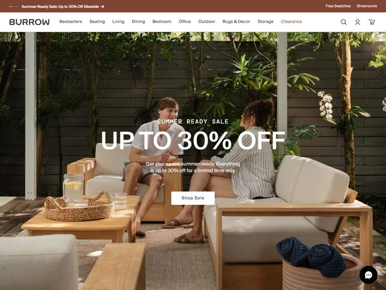

# Burrow — https://burrow.com

- **niche:** home
- **mood:** warm-playful
- **style:** photographic, lifestyle, editorial, warm
- **palette:** bg `#FFFFFF` · ink `#1C1A17` · accent `#7A3B2E` — The warm terracotta-brown only appears in the top promo bar and as the "Clearance" link in the nav; the hero itself leans on the natural greens and warm woods of the photograph, with text reversed to white over the image.
- **type:** display *condensed grotesque (Trade Gothic Bold Condensed / Heading Pro Treble) set ALL-CAPS, very wide* · body *humanist sans (Graphik / Söhne), light gray-white* — Confident retail-sale voice; the headline shouts in flattened caps, the subhead stays soft and conversational.
- **sections:** hero › category-tiles › bestsellers-grid › modularity-explainer › materials/sustainability › social-proof-press › reviews › cta › footer
- **signature:** The whole fold is one immersive outdoor-living lifestyle photo — a couple lounging on a teak sectional in a lush, tree-lined backyard at golden hour — with the sale message overlaid centered in white. Instead of isolating product on seamless white (the DTC-furniture default), Burrow stages the furniture *in use* in an aspirational real space, then drops a department-store-style "UP TO 30% OFF" right across the middle. It's catalog warmth fused with flash-sale urgency.
- **imagery:** Full-bleed editorial lifestyle photography — natural light, real models mid-conversation, warm wood + cream cushions + jute rug + woven tray + plants. No 3D, no illustration, no studio cutouts; the treatment is sun-dappled and lived-in, almost a furniture-brand magazine spread.
- **copy:** Direct, seasonal, benefit-led retail. Eyebrow "SUMMER READY SALE", headline "UP TO 30% OFF", subhead "Get your space summer-ready. Everything is up to 30% off for a limited time only." with a white "Shop Sale" pill button. Top promo bar repeats "Summer Ready Sale: Up to 30% Off Sitewide".

**Takeaways (steal as ideas, don't copy):**
- Sell furniture by photographing it *in use* in an aspirational real environment (backyard, golden hour, people relaxing) instead of isolating it on a white seamless background.
- Center reversed-white headline type over a busy lifestyle photo, but anchor it on the calmest region of the frame (here the muted wood-fence wall) so caps stay legible without a scrim.
- Pair a flattened ALL-CAPS condensed sale number with a soft, conversational subhead — loud + warm at once, not just one register.
- Keep brand color to the promo bar and a single nav highlight ("Clearance"), letting the photograph's natural greens and woods carry the hero palette.
