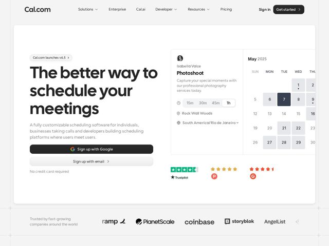

# Cal — https://cal.com

- **niche:** productivity
- **mood:** clean-light
- **style:** minimal, bento
- **palette:** bg `#FFFFFF` · ink `#0F0F12` · accent `#1A1A1A` — O preenchimento do CTA primário 'Sign up with Google' e o botão de nav 'Get started' são quase pretos; a única cor cromática vem do chip de data selecionada do calendário (slate #3E4A5E) e dos logos dos selos de avaliação de terceiros (Trustpilot verde, estrelas Capterra/G2 em vermelho).
- **type:** display *Cal Sans (grotesca geométrica; terminais arredondados, 'a' de uma andar, tracking apertado, peso bem pesado)* · body *Inter / sans grotesca neutra* — confiante, geométrica-amigável, superdimensionada e com tracking apertado — brincalhona, mas confiável para o público enterprise
- **sections:** hero › logos › feature-ai-calls › how-it-works › feature-bento › testimonials › feature-grid › cta › footer
- **signature:** O hero combina um título gigante alinhado à esquerda com um widget de produto AO VIVO e interativo à direita — um cartão de agendamento de verdade (avatar, título do evento, pílulas de duração 15m/30m/45m/1h, local, fuso horário) ao lado de um calendário mensal real com datas selecionáveis. O produto se demonstra sozinho no hero em vez de mostrar um screenshot estático.
- **imagery:** UI de produto como arte do hero: componentes de agendamento reais e renderizados (não screenshots) flutuando sobre branco dentro de um grande contêiner de cantos arredondados, com borda suave. Sem fotografia, sem 3D, sem gradientes — o chrome da interface É a imagem. A prova social é renderizada como logos autênticos de selos de terceiros (Trustpilot/Capterra/G2) em vez de apenas glifos de estrelas.
- **copy:** Título de benefício em linguagem franca, sem jargão — o hero diz "The better way to schedule your meetings" com uma linha de apoio nomeando os três públicos (indivíduos, empresas, desenvolvedores); a voz é direta, inclusiva e de baixo hype.

**Takeaways (roube como ideias, não copie):**
- Transforme a coluna direita do hero em um fragmento funcional do produto — pílulas de duração (15m/30m/45m/1h) e um calendário clicável — para que o valor seja demonstrado, não descrito.
- Empilhe um CTA primário de baixo atrito ('Sign up with Google' com o logo do provedor), um botão fantasma secundário 'Sign up with email' e uma pequena linha de garantia 'No credit card required' logo abaixo — uma escada de comprometimento em três níveis.
- Envolva o hero inteiro em um grande cartão de cantos arredondados com borda fininha flutuando sobre quase-branco, e então rode uma faixa discreta de logos 'Trusted by fast-growing companies' logo fora/abaixo dele, como uma sub-banda discreta.
- Use uma paleta quase monocromática e deixe a ÚNICA cor entrar pelos selos de confiança emprestados (Trustpilot verde, estrelas de avaliação vermelhas) — a cor sinaliza credibilidade, não decoração de marca.
