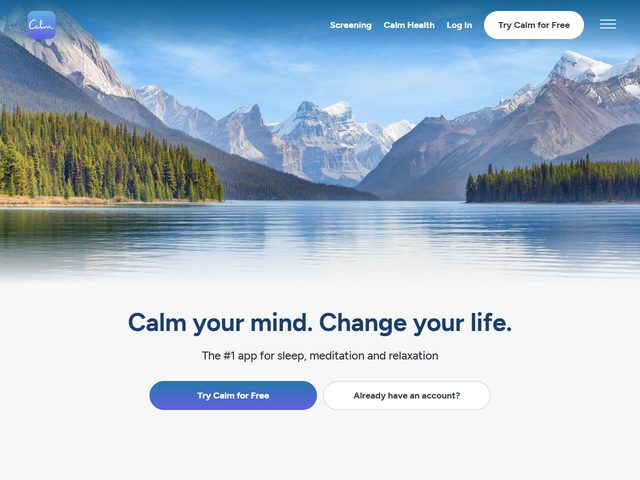

# Calm — https://www.calm.com

- **niche:** health
- **mood:** clean-light
- **style:** photographic, serene, rounded, friendly
- **palette:** bg `#F1F3F4` · ink `#1F3A6E` · accent `#5A6FE0` — The blue-violet accent shows up only as the gradient fill of the primary "Try Calm for Free" pill (a soft indigo-to-blue wash) and the small rounded logo badge; everything else is photo-blue and navy ink, so the one saturated gradient button is the single click target your eye lands on.
- **type:** display *rounded geometric sans (Proxima Nova Soft / Circular-like), heavy weight, near-zero tracking* · body *same family, regular, muted slate-gray* — Soft, reassuring, plainspoken; the rounded terminals deliberately sand off any corporate edge.
- **sections:** hero › value-props (sleep / meditation / relaxation) › app-preview › expert-content › testimonials › science-backed › pricing › cta › footer
- **signature:** The fold is split into two distinct halves: the top ~60% is an edge-to-edge, full-bleed photograph of a glassy mountain lake (Maligne Lake / Spirit Island energy) that fades softly into a flat light-gray panel where all the text and buttons live. The photo isn't a backdrop behind the copy — it's a standalone calming "view" stacked above the message, so the image does the emotional work and the type stays perfectly legible on clean gray. The serenity is sold by the picture before a single word is read.
- **imagery:** A single hero-grade landscape photograph (snow-capped peaks, pine-lined shore, mirror-still water) treated naturalistically with no overlays or filters, bleeding to the viewport edges and dissolving via a gradient into the gray content zone below. No illustration, no 3D, no product UI in the fold — just one aspirational nature scene.
- **copy:** Warm, benefit-first, two-clause promise. Headline reads **"Calm your mind. Change your life."** (a near-internal-rhyme couplet, the second sentence in lighter weight as a turn), with subhead **"The #1 app for sleep, meditation and relaxation"** — instant credibility plus the three use-cases in one breath.

**Takeaways (steal as ideas, don't copy):**
- Stack a full-bleed atmospheric photo on TOP of a flat content panel rather than putting text over the image — you get emotional imagery AND flawless type legibility, no scrim needed.
- Make the headline a tiny two-beat couplet ("Calm your mind. Change your life.") and vary weight between the clauses so the second half reads as a payoff, not a repeat.
- Reserve your one saturated gradient for the single primary CTA; let the photo and a muted navy carry everything else so the button is unmissable.
- Pair the primary CTA with a quiet "Already have an account?" outline pill — onboards new users and returning users in the same row without competing for attention.
