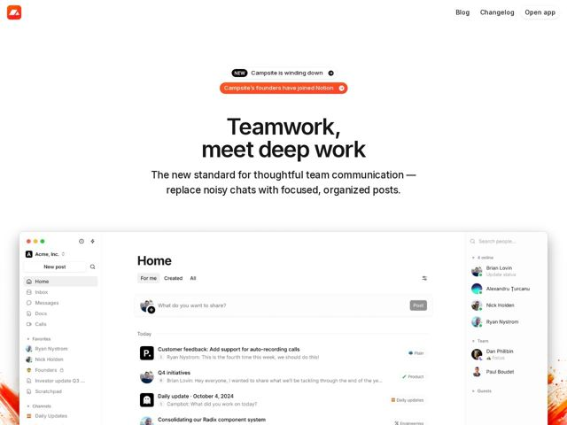

# Campsite — https://campsite.design

- **niche:** productivity
- **mood:** clean-light
- **style:** minimal, clean, light
- **palette:** bg `#FFFFFF` · ink `#1A1A1A` · accent `#F1421B` — marca do logo, a segunda pílula de aviso (preenchimento total), setas/chips de link inline, e o gradiente quente de brasa vazando atrás do screenshot do produto
- **type:** display *grotesca estilo Söhne / GT America (sans geométrica, tracking apertado)* · body *mesma sans grotesca, peso mais leve* — Nítida, confiante, neutra-moderna; espaçamento entre letras quase zero, tamanho óptico grande, sem floreio
- **sections:** hero › feature-posts-positioning › feature-transparency › feature-references › feature-notifications › feature-messaging › feature-integrations › footer
- **signature:** Dois banners de aviso em pílula, empilhados e flutuando bem no centro acima do título — um preto "NEW Campsite is winding down," outro laranja sólido "Campsite's founders have joined Notion" — cada um com um chip de seta circular, transformando o próprio encerramento do produto na primeira coisa que você vê.
- **imagery:** Único screenshot superdimensionado de produto, do feed Home do app (sidebar + fluxo de posts + painel de presença), renderizado nítido e em fidelidade total, ancorado na base do hero e sangrando pela borda inferior, de modo que lê como uma janela real para dentro da qual você está espiando. Um tênue gradiente laranja-quente de brasa/faísca vaza de baixo para cima, a partir do canto inferior esquerdo, atrás da UI, fazendo referência ao logo de fogueira.
- **copy:** Título aspiracional de antítese em duas linhas — "Teamwork, meet deep work" — enquadrando o produto como uma reconciliação de dois modos opostos; voz calma, declarativa, quase-manifesto, com um subhead que nomeia o problema ("replace noisy chats with focused, organized posts").

**Takeaways (roube como ideias, não copie):**
- Empilhe duas pílulas de aviso acima do H1 (uma neutra, uma preenchida com o acento) para sobrepor uma atualização de status a uma proposta de valor, sem que uma barra de banner roube o hero.
- Centralize o hero inteiro — pílulas, título, subhead — e então quebre a simetria ancorando um único screenshot gigante do produto rente à borda inferior, de modo que ele sangre para fora do quadro.
- Deixe um único gradiente quente (amostrado da cor do logo) vazar de um canto para cima atrás de uma captura de UI de resto totalmente branca — apenas calor suficiente para evitar o chapado-clínico sem adicionar nenhuma decoração.
- Escreva o título como uma antítese de duas palavras ('X, meet Y') que nomeia a tensão que seu produto resolve, e deixe o subhead fazer a explicação literal de 'substitua A por B'.
