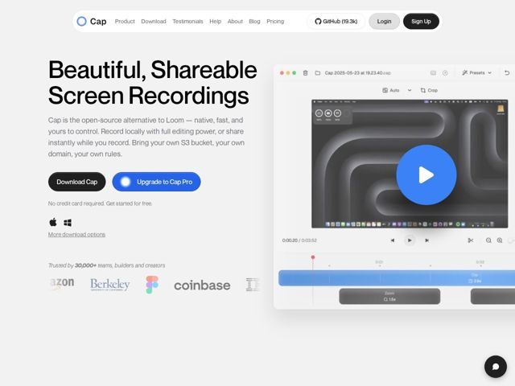

# Cap — https://cap.so

- **niche:** dev-tools
- **mood:** clean-light
- **style:** minimal, clean, light
- **palette:** bg `#F1F1EF` · ink `#0A0A0A` · accent `#2D7FF9` — Botão em pílula do CTA primário 'Upgrade to Cap Pro', o overlay circular de play sobre a captura do produto, e o scrubber da timeline / destaque de clipe dentro do screenshot do editor
- **type:** display *Inter (ou grotesca geométrica quase idêntica) em peso heavy/black* · body *Inter em peso regular* — Apertada, confiante, ultralimpa; o título em peso black contra o fundo cinza-claro dá um swagger moderno de dev-tool sem soar alto
- **sections:** hero › logos › feature-overview › problem › feature-grid › testimonials › pricing › faq › footer
- **signature:** A captura de produto do hero é um mock de editor com cara de ao vivo e interativo — chrome completo de janela macOS, uma timeline real com pistas de zoom/clipe e um botão de play azul tocável — que sangra pela borda direita da viewport, então a página lê como "aqui está o app de verdade" em vez de uma ilustração de marketing.
- **imagery:** Conduzida por screenshot de produto: uma grande janela de app levemente girada mostrando a UI real de gravação/edição (timeline, trilha de zoom, presets) com um chrome macOS real. Um overlay de botão de play azul vibrante fica sobre uma tela de gravação em escala de cinza e atmosférica, fazendo a página em cinza-pastel suave parecer viva. Sem 3D abstrato ou fotos de banco — o produto É o visual.
- **copy:** Declaração confiante, com o produto à frente e um ângulo de propriedade open-source. Título do hero: "Beautiful, Shareable Screen Recordings"; o subhead o enquadra como "the open-source alternative to Loom — native, fast, and yours to control."

**Takeaways (roube como ideias, não copie):**
- Combine um CTA duplo em que a ação secundária ganha a cor de acento: o gratuito 'Download Cap' é preto-fosco enquanto o pago 'Upgrade to Cap Pro' veste o azul vibrante + um ícone — invertendo a hierarquia primário/secundário de sempre para empurrar os upgrades.
- Ancore o hero em um screenshot real do editor com chrome de SO completo e uma timeline de aparência funcional, e então deixe-o sangrar para além da borda da viewport, para que pareça uma janela para o app ao vivo, não um mockup emoldurado.
- Use um fundo de página cinza-quente quase-branco (#F1F1EF) em vez de branco puro, para que um único acento azul saturado e um título preto se destaquem com cor mínima no resto.
- Empilhe sinais de confiança bem juntos sob o CTA: uma contagem de estrelas 'GitHub (19.3k)' na nav mais uma linha 'Trusted by 30,000+ teams' sobre uma fileira de logos em escala de cinza desbotada (Amazon, Berkeley, Figma, Coinbase) — credencial open-source e credencial enterprise em um só fôlego.
