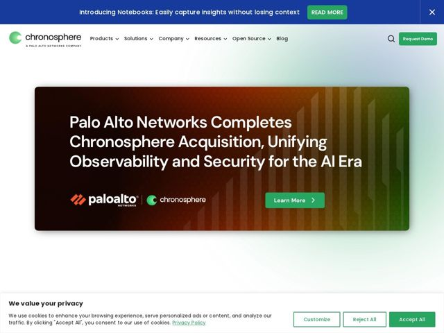

# Chronosphere — https://chronosphere.io

- **niche:** observability / devops (Kubernetes monitoring)
- **mood:** clean-light
- **style:** clean-light, gradient, cinematic, colorful
- **palette:** bg `#FFFFFF` · ink `#0E1A2B` · accent `#1FA463` — logo mark, primary CTA buttons (Request Demo, Accept All), inline link underlines, and the brand-green edge of the hero gradient
- **type:** display *Poppins (geometric sans, bold weights for hero headline)* · body *Poppins 400* — friendly-geometric and rounded; the single-typeface system keeps it approachable rather than enterprise-stiff, softening a hardcore infra topic
- **sections:** announcement-bar › hero (acquisition feature card) › news › featured-resources › feature (Platform + Pipeline for Control) › feature (AI Guided Troubleshooting) › benefits (Control Costs / Incidents / Complexity) › resources › logos (Trusted By Industry Leaders) › footer
- **signature:** The hero is not a product pitch but a full-bleed acquisition announcement card rendered as a cinematic earth-to-green horizontal gradient with embossed bar-chart texture — co-branding two logos in the headline slot where a value prop usually lives. It treats corporate news as the hero spectacle.
- **imagery:** Abstract gradient panels rather than product UI: a warm rust-orange-to-olive-green wash with subtly embossed vertical bars evoking time-series/bar-chart data. Co-branded vendor logos lockup. Soft pastel green-and-blue ambient glow bleeds onto the white page background around the hero.
- **copy:** Authoritative, control-themed enterprise voice anchored on one word ("Control"); real hero headline shown is the acquisition card: "Palo Alto Networks Completes Chronosphere Acquisition, Unifying Observability and Security for the AI Era" (page H1: "Observability Built for Control").

**Takeaways (steal as ideas, don't copy):**
- Anchor an entire benefits architecture on one repeated verb — 'Control Costs / Control Incidents / Control Complexity' — so the value prop becomes a memorable triad.
- Render a data-domain texture (embossed time-series bars) directly into the hero gradient instead of screenshotting a dashboard — abstract the product into mood.
- Use a horizontal multi-zone gradient (warm rust to brand green) as a single panel so brand color earns a 'home' edge while the rest stays neutral and cinematic.
- Let a co-branded logo lockup carry the hero headline slot when news IS the story — a bold alternative to the default feature-first hero.
