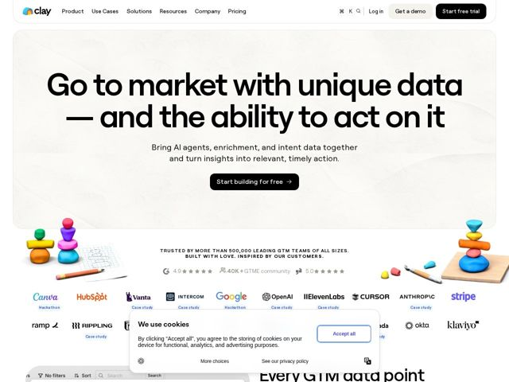

# Clay — https://clay.com

- **niche:** data
- **mood:** editorial-minimal
- **style:** minimal, 3d, illustrated
- **palette:** bg `#F4F2EE` · ink `#0A0A0A` · accent `#1A8CFF` — Ponto do logo e pequenos destaques de produto/3D; a página pende para o monocromático — os CTAs primários são pílulas pretas sólidas, então o azul lê como uma centelha de marca contida, não como a cor de ação
- **type:** display *Inter (ou grotesca quase-geométrica) em peso heavy/black, tracking bem apertado* · body *Inter regular* — Confiante, moderna, neutra — letras superdimensionadas do título em preto é que falam; corpo de texto editorial e contido
- **sections:** hero › logos › feature-data › feature-ai › feature-orchestrate › feature-workflows › security › testimonials › cta › footer
- **signature:** Mascotes de "clay" em pedras empilhadas: esculturas 3D brilhantes de rochas equilibradas em cores primárias de doce, uma nua e outra sobre uma tabuinha de madeira, ladeando o hero como apoios de livros de jardim zen — literalizando o nome da marca como um brinquedo tátil.
- **imagery:** 3D abstrato e brincalhão: pedrinhas brilhantes de "clay" empilhadas (equilíbrio de rochas zen) em cores primárias, combinadas com lápis desenhados à mão / rabiscos de caderno. Objetos 3D lúdicos, táteis e estilo mascote ladeando o hero em vez de UI de produto; um screenshot real do produto (barra de filtros/ordenação) começa a espiar logo abaixo da dobra.
- **copy:** Liderada por resultado, declarativa e em linguagem franca. H1 real do hero: "Go to market with unique data — and the ability to act on it." O subhead nomeia o trio do produto (AI agents, enrichment, intent data) e então promete ação — benefício antes dos recursos.

**Takeaways (roube como ideias, não copie):**
- Literalize o nome da sua marca como um adereço-mascote 3D: a clay.com constrói esculturas brilhantes de pedras equilibradas a partir da palavra 'clay' e as usa como apoios de livros no hero — transforme um produto abstrato em um objeto tocável.
- Tela off-white quente (#F4F2EE) dentro de um painel arredondado em vez de branco cru — suaviza um produto de dados/B2B e dá uma calma editorial, de papel.
- Vá quase monocromático: CTAs em pílula preta sólida + título preto, reservando um único azul saturado apenas para o acento do logo — torna a ação óbvia e a marca chamativa sem ruído de cor.
- Título de hero que combina o substantivo ('unique data') com o verbo ('the ability to act on it') via um travessão — vende o diferencial e a recompensa em um só fôlego.
