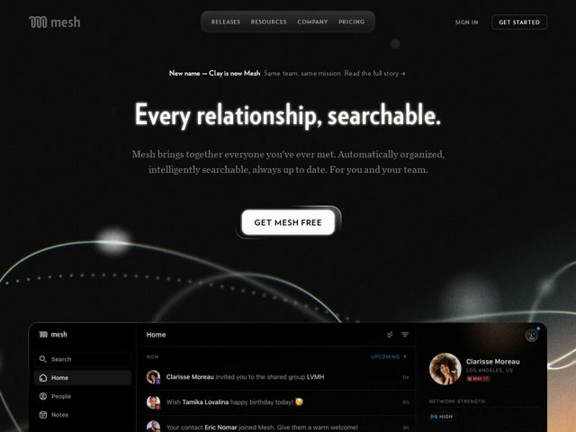

# Clay — https://clay.earth

- **niche:** crm
- **mood:** premium-luxe
- **style:** dark, cinematic, gradient
- **palette:** bg `#0C0A0A` · ink `#F4F1EC` · accent `#7FB7D9` — arco iridescente de fio-de-luz cruzando a parte inferior do hero; leves brilhos prismáticos na linha orbital e nas bordas da UI do produto
- **type:** display *Serifa transicional de alto contraste (próxima de Didone, ex.: estilo Canela / Ogg)* · body *Serifa de livro old-style combinando, com serifas em colchete* — Literária, editorial, calorosa e humana — um sistema serifado numa categoria que adota por padrão sans geométrica, sinalizando memória, intimidade e ofício acima da utilidade-software
- **sections:** hero › feature-never-miss › feature-network-control › feature-team › testimonials › logos › cta › footer
- **signature:** Uma voz totalmente serifada sobre uma tela quase preta, de escuridão fotográfica — o título brilha como texto retroiluminado e um único filamento iridescente de luz arqueia pelo vazio. Rejeita o visual claro, de sans geométrica e grade de screenshots que toda ferramenta de CRM/relacionamento usa, lendo-se mais como uma cartela de título de filme ou um anúncio de perfume de luxo.
- **imagery:** Um painel flutuante e inclinado da UI do produto renderizado em dark mode combinando (de modo que se dissolve na página em vez de ficar dentro de um chrome de navegador branco), aquecido por um vazamento de gradiente âmbar/pêssego nos cantos. Atrás dele, um arco orbital abstrato de luz pontilhada e um tênue fio prismático sugerem uma rede/constelação sem diagramas literais de nós. Avatares humanos reais dentro da UI somam intimidade.
- **copy:** Promessa emocional de duas palavras em serifa — o hero diz "Every relationship, searchable." (variante factual "Every relationship, remembered.") — calorosa, declarativa, humana antes de orientada a recursos.

**Takeaways (roube como ideias, não copie):**
- Defina todo o seu sistema tipográfico em uma serifa de alto contraste para humanizar um produto de dados/CRM — memória e relacionamentos passam a parecer literários, não transacionais.
- Renderize o screenshot do produto em dark mode de verdade para que ele se funda numa tela preta em vez de flutuar num chrome de navegador branco, e então aqueça as bordas com um único brilho de gradiente âmbar.
- Use um único fio fino e iridescente de luz como a única cor numa página monocromática — ele carrega a metáfora de 'rede/conexão' sem um grafo literal de nós.
- Trate a mudança de nome como um recurso de destaque: uma pílula discreta ('New name — Clay is now Mesh, same team same mission') transforma um rebrand em sinal de confiança em vez de escondê-lo.
