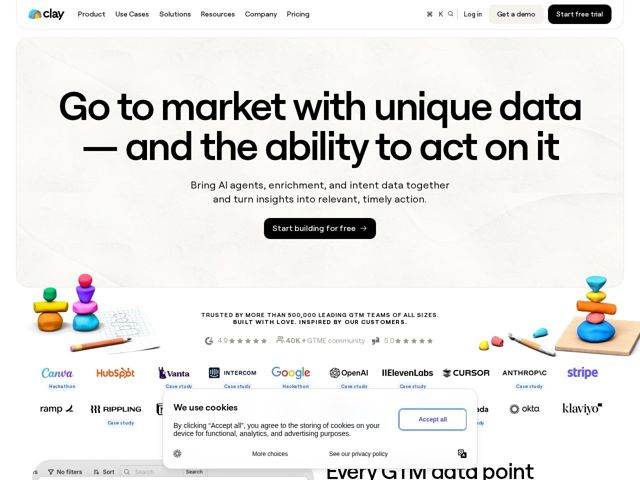

# Clay — https://clay.run

- **niche:** gtm-data / sales-intelligence (dev-tools-adjacent ops automation)
- **mood:** clean-light
- **style:** minimal, 3d, illustrated, mono-type
- **palette:** bg `#F4F2EC` · ink `#0A0A0A` · accent `#FF8A3D` — mascotes lúdicos 3D de pilhas de argila/pedra ladeando o hero (blobs laranja, rosa, roxo, azul, teal); também tinge os logos das marcas na fileira de confiança
- **type:** display *Sans-serif grotesca, tracking bem apertado, peso pesado (custom/estilo Aeonik)* · body *Sans humanista neutra (mesma família, peso regular)* — Confiante, em escala enorme, com título quase de margem a margem que se lê como afirmação de capa de revista em vez de tagline de produto
- **sections:** hero › logos › feature-data-platform › feature-ai › feature-orchestration › feature-workflows › feature-security › testimonials › cta › footer
- **signature:** A categoria de ferramentas de dados grita gráficos e dashboards; a Clay, em vez disso, ancora o hero com esculturas táteis de pilhas de argila/pedra 3D feitas à mão (ilustrando literalmente o nome da marca) sobre uma tela de papel com textura quente — fisicalidade de brinquedo onde os concorrentes mostram grades e gráficos.
- **imagery:** Mascotes em render 3D de argila estilizado (pilhas equilibradas de seixos/blobs) mais objetos de mesa (lápis, bloco de esboço, borracha) sobre um fundo de papel texturizado off-white suave; seções seguintes mudam para a UI real do produto (chrome de tabela com filtro/ordenação espreitando na parte de baixo). Mistura renders artesanais lúdicos com screenshots literais do app.
- **copy:** Promessa ousada liderada por resultado, voz simples e confiante — hero: "Go to market with unique data — and the ability to act on it"; sub: "Bring AI agents, enrichment, and intent data together and turn insights into relevant, timely action."

**Takeaways (roube como ideias, não copie):**
- Renderize a metáfora do seu produto como um objeto físico 3D (clay = esculturas de pilhas de argila) em vez de iconografia abstrata — instantaneamente memorável e fiel à marca
- Use uma tela off-white de papel com textura quente em vez de branco-puro clínico/escuro para parecer artesanal e humano numa categoria analítica
- Deixe o título correr enorme e quase de margem a margem com tracking apertado para que se leia como uma afirmação editorial, não um rótulo
- Emoldure a fileira de confiança com personalidade: 'TRUSTED BY 500,000+ GTM TEAMS... BUILT WITH LOVE, INSPIRED BY OUR CUSTOMERS' mais avaliações em estrelas, não apenas um mural silencioso de logos
