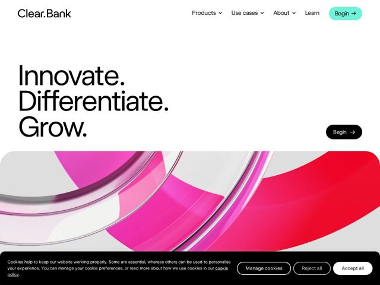

# Clear — https://clear.bank

- **niche:** fintech
- **mood:** editorial-minimal
- **style:** minimal, 3d, colorful
- **palette:** bg `#FFFFFF` · ink `#0A0A0A` · accent `#5DEBC8` — Reserved almost exclusively for the primary 'Begin' nav CTA pill (mint-teal fill); secondary CTAs invert to a black pill. The hot pink-to-red is image-only, never UI chrome.
- **type:** display *Aeonik (geometric grotesque) — tight-set, near-black weight, lining lowercase* · body *Aeonik / system grotesque at regular weight* — Confident, neutral-modern grotesque; oversized and air-tight, lets the period after each word do the talking
- **sections:** hero › logos › feature-clearing › feature-embedded-banking › feature-accounts › feature-api › how-it-works › problem › feature-audience-grid › testimonials › cta › footer
- **signature:** The hero copy is set as three one-word sentences stacked on their own lines — "Innovate. / Differentiate. / Grow." — each terminated by a full stop, turning punctuation into rhythm and a manifesto-style cadence rather than a phrase.
- **imagery:** Abstract 3D: a single oversized glassy/chrome torus ring rendered in a hot-pink-to-crimson gradient with translucent acrylic edges, bleeding edge-to-edge as a full-width band directly beneath the hero text. One sculptural hero object, photoreal render, no product UI shots up top.
- **copy:** Verb-only imperative manifesto — three standalone command words. Hero headline reads literally: "Innovate. Differentiate. Grow." (tagline elsewhere: "The bank built for game changers").

**Takeaways (steal as ideas, don't copy):**
- Punctuate single words into a vertical stack — one verb per line, each closed with a period — so the headline scans as a chant instead of a sentence.
- Quarantine your accent color: let a vivid 3D image carry ALL the saturation (pink/red render) while the UI accent is one calm mint pill on a single hero CTA. Loud art, quiet interface.
- Float a redundant second 'Begin' CTA at the lower-right of the hero, just above the image seam — catches the eye after it finishes reading the manifesto, not before.
- Bleed the hero render full-bleed as a horizontal band that the headline sits ABOVE on pure white — text breathes in negative space, color lives below the fold-line.
