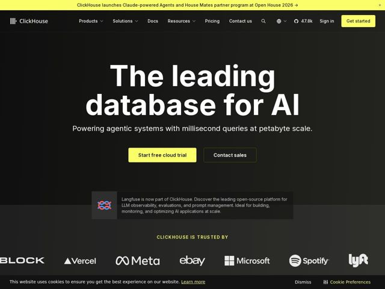

# Clickhouse — https://clickhouse.com

- **niche:** dev-tools
- **mood:** technical-dark
- **style:** dark, mono-type, minimal
- **palette:** bg `#0A0A0A` · ink `#FFFFFF` · accent `#F5F557` — top announcement bar (full-width), primary CTA button fill, the small 'CLICKHOUSE IS TRUSTED BY' eyebrow label, and inline link/arrow highlights
- **type:** display *Geometric grotesque sans (Inter / SF-like), heavy weight* · body *Same humanist grotesque sans, regular weight* — Engineered and confident — near-black ultra-bold display at enormous scale paired with calm regular-weight body; reads like a systems-software brand, not a marketing site
- **sections:** announcement-bar › nav › hero › logos › feature-grid › feature-realtime › why-clickhouse › integrations › how-it-works › deploy-options › social-proof › faq › cta › footer
- **signature:** A single horizontal slab of electric-chartreuse yellow pinned across the very top of an almost-black page — the same one acid color is rationed to ONLY the announcement bar, the primary CTA, and a tiny eyebrow label, so the whole identity rides on one violently saturated hue against near-monochrome darkness instead of the usual blue/violet dev-tool gradient.
- **imagery:** Near-zero photography or 3D. The hero is pure type on a subtle near-black radial/vignette gradient. Brand identity carried by monochrome customer logos (Block, Vercel, Meta, eBay, Microsoft, Spotify, Lyft) rendered flat white in a single trusted-by row, plus small partner glyphs (Langfuse) in a bordered callout card. Imagery language is restraint: logos and typography do the work, not illustration.
- **copy:** Blunt category-ownership claim in plain language; hero: "The leading database for AI" + subhead "Powering agentic systems with millisecond queries at petabyte scale."

**Takeaways (steal as ideas, don't copy):**
- Ration a single hyper-saturated accent (acid chartreuse) to exactly three touchpoints — top bar, primary CTA, one eyebrow label — and let near-black + white carry everything else; scarcity makes the color feel like a system status light, not decoration.
- Make the hero headline absurdly large (4-line-equivalent slab filling half the viewport) so the page works as a billboard with zero imagery — type IS the art direction.
- Pair a hard quantitative subhead ('millisecond queries at petabyte scale') with a soft category claim ('leading database for AI') so you get both emotional positioning and an engineer's proof in two lines.
- Use a full-width chartreuse announcement bar to ship product news (Claude-powered Agents) above the nav — turns the top edge into a always-on changelog that reinforces momentum.
