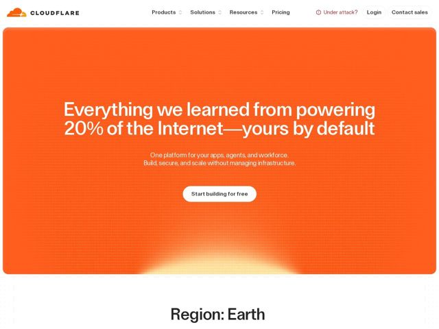

# Cloudflare — https://cloudflare.com

- **niche:** infra
- **mood:** bold-loud
- **style:** bold, colorful, mono-type
- **palette:** bg `#F6821F` · ink `#FFFFFF` · accent `#FFC97A` — brilho de horizonte amarelo-branco quente vazando de baixo para cima a partir da base do hero laranja, como um nascer do sol sobre a dobra; abaixo da dobra vira bg branco com ink quase preto
- **type:** display *grotesca geométrica fechada (a sans da casa da Cloudflare, parecida com uma Inter/Söhne de tracking condensado), em escala enorme e justa* · body *sans humanista combinando em tamanho de leitura calmo* — confiante, direta, quase editorial — o título grita pela escala e pela cor, não pela decoração
- **sections:** hero › feature-region-earth › logos-fortune500 › problem › how-it-works › feature-grid › pricing-usage › feature-security › feature-ai › cta › footer
- **signature:** Toda a área acima da dobra é inundada de margem a margem no laranja saturado da marca com um brilho de falso nascer do sol subindo da base — páginas de infra/dev quase universalmente vão de technical-dark a clean-white, então um hero laranja-quente em full-bleed com um gradiente de nascer do sol é uma genuína quebra de convenção que se lê como uma afirmação de marca, não um template de SaaS.
- **imagery:** Quase nenhuma imagem literal no hero — o visual é puro campo de cor mais uma sutil textura de pontos/grade e um bloom de luz radial no horizonte. A marca (a nuvem laranja) é o único ícone. A imagem é substituída por escala tipográfica e gradiente atmosférico; seções seguintes introduzem o enquadramento de planeta/"Region: Earth".
- **copy:** Autoridade ousada e direta exibindo escala como prova — o hero diz: "Everything we learned from powering 20% of the Internet—yours by default"

**Takeaways (roube como ideias, não copie):**
- Inunde todo o hero em uma única cor de marca saturada e deixe um título superdimensionado e de tracking apertado carregar a página — nenhum screenshot de produto necessário acima da dobra.
- Adicione um brilho radial atmosférico de 'nascer do sol' subindo da borda inferior para dar profundidade a um campo de cor chapado e um horizonte otimista.
- Transforme estatísticas brutas de escala em texto de título ('20% of the Internet', '42% of the Fortune 500') para que a gabolice SEJA a proposta de valor, não uma barra de logos separada.
- Use enquadramento geográfico poético como 'Region: Earth' como cabeçalho de seção para fazer infra commodity parecer planetária e ambiciosa.
