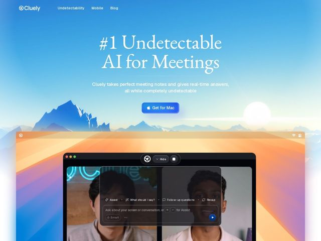

# Cluely — https://cluely.com

- **niche:** ai
- **mood:** other
- **style:** gradient, photographic, cinematic
- **palette:** bg `#6FB0E8` · ink `#FFFFFF` · accent `#2563EB` — primary CTA pill button ('Get for Mac'), the in-app send button, and small UI accents inside the product screenshot
- **type:** display *Transitional serif (high-contrast, Times/Tiempos-like) for the hero H1* · body *Neutral humanist sans-serif for subhead, nav, and UI* — Editorial-meets-utility: a literary, almost magazine-cover serif headline grounding an otherwise functional product UI — confident, premium, a little cheeky
- **sections:** hero › how-it-works › feature-instant-notes › feature-undetectable › feature-participants › feature-transcription › faq › cta › footer
- **signature:** A serene, photographic sunrise-over-mountains landscape as the full-bleed hero backdrop — sky blue fading into golden dawn with a literal rising sun — paired with a high-contrast serif headline. It rejects the dark-mode, neon-grid, glassmorphic cliche of AI tools entirely; the vibe is calm and aspirational rather than technical, while the product screenshot crashes in from the bottom edge.
- **imagery:** Full-bleed cinematic landscape photo (blue sky to orange sunrise over layered mountain silhouettes) anchors the hero. The product is shown as a realistic, chrome-accurate macOS app window with a translucent floating assistant bar over a live two-person video call, half-bleeding off the bottom of the viewport so the UI feels caught mid-use rather than staged.
- **copy:** Provocative one-liner positioning that leans into taboo: serif hero reads "#1 Undetectable AI for Meetings" with subhead "Cluely takes perfect meeting notes and gives real-time answers, all while completely undetectable" — blunt, confident, slightly transgressive voice.

**Takeaways (steal as ideas, don't copy):**
- Pair an editorial serif headline with a calm photographic nature backdrop to make an AI product feel premium and human instead of cold and technical.
- Bleed the real product UI off the bottom edge of the hero so the demo reads as 'live, in use' and pulls the eye into a scroll.
- Use a warm sunrise gradient (cool sky -> golden horizon) as the emotional through-line instead of the default dark/neon AI palette.
- Build trust with a single sky-blue brand-accent CTA pill that visually matches the in-app send button, tying the marketing site directly to the product.
