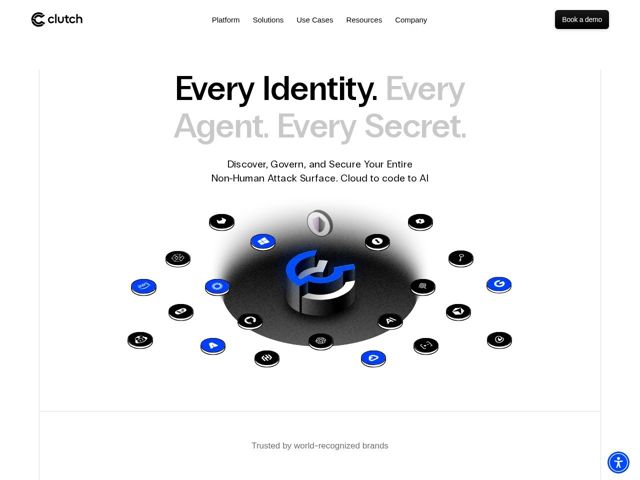

# Clutch — https://clutch.security

- **niche:** security
- **mood:** clean-light
- **style:** minimal, 3d, mono-type
- **palette:** bg `#FFFFFF` · ink `#0A0A0A` · accent `#1A4BFF` — a metade secundária do título em cinza claro, mais o hub do logo 3D em azul-elétrico e um punhado dos coin-tokens em órbita
- **type:** display *Inter (peso pesado, tracking bem apertado)* · body *Inter* — Disciplina de tipografia única levada ao extremo — o hero roda Inter em peso quase black de display com espaçamento condensado para se ler quase como uma grotesca custom, enquanto o corpo cai para um peso regular calmo. Confiante, engenheirada, sem rodeios.
- **sections:** hero › logos › problem › feature-platform › feature-what-it-secures › how-it-works › feature-approach › how-it-works › testimonials › cta › footer
- **signature:** Uma peça central 3D fotorrealista de "control hub": um disco extrudado e brilhante do logo sobre um pedestal com sombra suave, cercado por um anel de coin-tokens físicos flutuantes pretos/azuis (cada um um ícone de fornecedor/agente). Transforma a ideia abstrata de governar identidades não-humanas num orrery tátil — quebrando o clichê de diagrama-plano-e-dashboard que domina o SaaS de segurança.
- **imagery:** Iconografia de produto renderizada em 3D sobre branco puro: moedas/chips chanfrados e robustos com realces especulares realistas e sombras de contato, dispostos numa órbita planetária ao redor de um monólito-logo do hero. Sem screenshots, sem fotos de banco de imagens, sem pessoas — apenas renders limpos de objetos físicos que se leem como premium e técnicos ao mesmo tempo.
- **copy:** Título em tríade staccato que nomeia a superfície de ameaça em três batidas — "Every Identity. Every Agent. Every Secret." — seguido de um subtítulo direto ("Discover, Govern, and Secure Your Entire Non-Human Attack Surface. Cloud to code to AI"); voz autoritária, que define a categoria.

**Takeaways (roube como ideias, não copie):**
- Divida um único título entre ink no presente e cinza fantasma para codificar dois pensamentos numa só linha sem uma segunda fonte ou cor
- Use o ritmo de três frases curtas com ponto final ('Every X. Every Y. Every Z.') para fazer uma categoria parecer exaustiva e inevitável
- Substitua o diagrama-plano padrão de segurança por uma 'órbita de objetos' 3D tátil para que um conceito invisível (identidades não-humanas) se torne algo que você consegue visualizar
- Lidere a seção de problema com um paradoxo de impacto ('They Exist Everywhere. They're Managed Nowhere.') em vez de uma lista de recursos
