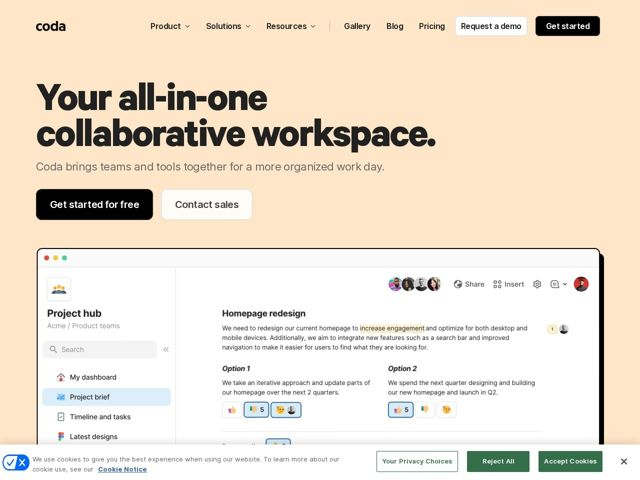

# Coda — https://coda.io

- **niche:** productivity
- **mood:** warm-playful
- **style:** minimal, bento
- **palette:** bg `#FCE2C4` · ink `#1A1A1A` · accent `#111111` — Preenchimentos quase pretos carregam o botão de CTA principal (Get started for free), a pílula Get started no canto superior direito e o título em ink pesado; os únicos verdadeiros toques de cor são as reações emoji verde/amarelo/vermelho e os pontos da janela macOS dentro do screenshot do produto.
- **type:** display *Replica LL / grotesca pesada (bem bold, apertada, sans quase condensada)* · body *Grotesca neutra tipo Inter (subtítulo, navegação, rótulos de UI)* — Confiante e robusta no topo, calma e utilitária abaixo — o contraste é a personalidade
- **sections:** hero › problem › feature-overview › feature-writeups › feature-hubs › feature-trackers › feature-applications › feature-ai › how-it-works › use-case-product › use-case-sales › use-case-engineering › use-case-design › use-case-marketing › use-case-hr › pricing › cta › footer
- **signature:** Uma única lavagem pêssego quente inunda todo o hero — sem gradiente, sem faixa de imagem de hero — de modo que a única coisa com peso visual é o título superdimensionado quase preto e um doc realista do produto flutuando abaixo; a página vende calma ao reter cor em vez de adicioná-la.
- **imagery:** Screenshot do produto em primeiro plano: um único mock grande de chrome de navegador com cantos arredondados de um doc Coda ao vivo (avatares, reações emoji, destaques inline) flutuando sobre o campo pêssego quente — parece um workspace compartilhado de verdade, não uma UI de banco de imagens.
- **copy:** Liderada por benefício, em tom simples; título real do hero "Your all-in-one collaborative workspace." com subtítulo "Coda brings teams and tools together for a more organized work day."

**Takeaways (roube como ideias, não copie):**
- Tinja todo o hero com um único pastel quente (pêssego #FCE2C4) e mantenha CTAs/texto em preto monocromático — o calor vem do campo, não de botões de destaque.
- Faça o título gritar: componha-o numa grotesca ultra-bold e apertada a ~3x o tamanho do subtítulo, depois caia para uma sans neutra e quieta em todo o resto para que o contraste de tamanho carregue a hierarquia.
- Ancore o hero com UM screenshot de produto de alta fidelidade mostrando humanos colaborando (avatares sobrepostos, contagens de reação emoji, destaques de texto inline) em vez de um dashboard abstrato — os emoji são a única cor saturada na tela.
- Estruture o corpo como uma grade baseada em papéis ('For product / sales / engineering / design / marketing / HR teams'), cada uma fechando com um repetido prompt 'Want to know more about running your X team on Coda?' — mesmo template, público trocado, escala a página sem novos layouts.
