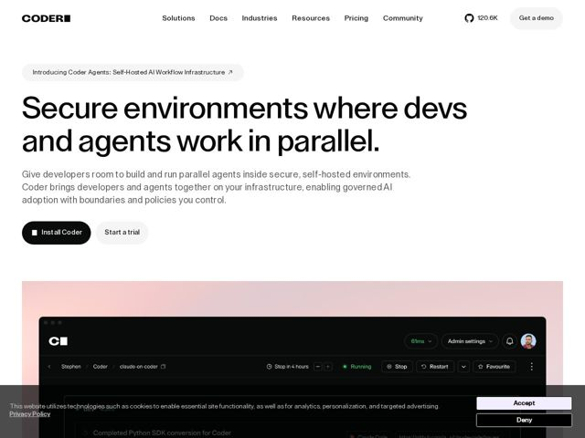

# Coder — https://coder.com

- **niche:** dev-tools
- **mood:** technical-dark
- **style:** minimal, mono-type, photographic
- **palette:** bg `#FFFFFF` · ink `#0A0A0A` · accent `#000000` — pílula de CTA preto sólido (Install Coder), screenshot quase preto da UI do produto e o pequeno glifo de quadrado preenchido que substitui o O no wordmark CODER
- **type:** display *Sans geométrica/grotesca com detalhamento de influência mono (custom ou estilo PP-Neue-Montreal)* · body *Mesma sans grotesca neutra, peso mais leve* — Engenheirada, precisa, próxima de terminal — o tracking apertado e um wordmark com ponto quadrado sinalizam 'infraestrutura para engenheiros' sem recorrer a monospace literal
- **sections:** nav › announcement-banner › hero › feature-open-secure › how-it-works › feature-govern-agents › industries › feature-products › cta › footer
- **signature:** O hero recusa o clichê dark-mode das ferramentas de dev: é uma tela toda branca e austera com tipografia de display superdimensionada quase preta, e a única 'cor' é um suave gradiente rosa-para-lilás vazando por trás do screenshot do produto — um calor quieto, quase editorial, sob uma página de engenharia de resto austera.
- **imagery:** Um único screenshot grande e realista da UI do produto numa janela estilo macOS escura (mostrando workspaces de agentes ao vivo — estados Running/Stop/Restart, threads de tarefa do Claude Code), flutuando sobre um pano de fundo de gradiente pastel. Interface fotorrealista sobre lavagem de cor, não ilustração abstrata ou 3D.
- **copy:** Declarativas confiantes de estrutura paralela que enquadram uma tensão (velocidade vs controle); o hero diz: "Secure environments where devs and agents work in parallel."

**Takeaways (roube como ideias, não copie):**
- Use um suave gradiente pastel (rosa->lilás) brilhando por trás de um screenshot de produto escuro para injetar calor numa página de engenharia de resto preto-e-branco
- Marque o logotipo com uma única troca de glifo geométrico (quadrado preenchido substituindo uma letra) em vez de uma marca custom completa — barato, memorável, no tema para ferramentas de infra
- Escreva os H2s como frases antitéticas pareadas ('Open by design. Secure by default.' / 'Code at speed. Stay in control.') para dramatizar a tensão central do produto
- Mostre o produto real rodando com estados de status ao vivo (Running, Stop in 4 hours) em vez de um mockup higienizado — prova-de-vida acima do acabamento
