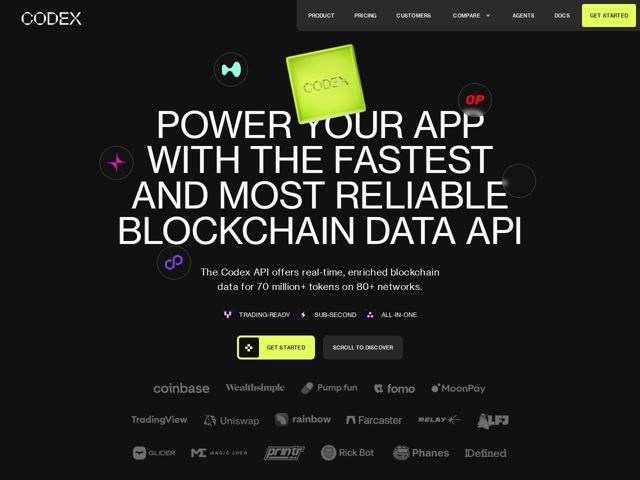

# Codex — https://codex.io

- **niche:** data-infra (blockchain/crypto data API for dev-tools)
- **mood:** technical-dark
- **style:** dark, 3d, mono-type, bold
- **palette:** bg `#0A0A0A` · ink `#FFFFFF` · accent `#D4F838` — preenchimento do CTA principal (botões 'Get Started'), o cubo Codex 3D de vidro flutuante, destaque do botão de navegação; aplicado com parcimônia contra o quase preto
- **type:** display *Sans grotesca/neo-grotesca condensada, toda em maiúsculas (hero grande superdimensionado, composto apertado)* · body *Sans humanista com formas de letra ligeiramente peculiares (o 'a' e o 'g' se leem mais quentes que o display)* — Alta, monumental, engenheirada — as maiúsculas condensadas superdimensionadas parecem um outdoor/estêncil industrial, suavizadas por uma voz de corpo mais amigável
- **sections:** hero › logos › feature-chart-data › feature-usd-pricing › feature-aggregate-data › logos › feature-network-support › testimonials › cta › footer
- **signature:** O cubo de vidro 3D fotorrealista verde-limão pairando sobre o hero, orbitado por ícones circulares flutuantes de tokens de crypto/rede (Polygon, OP, etc.) espalhados pelo título — uma fisicalidade lúdica, quase de brinquedo, que quebra a convenção plana e austera do marketing de API de blockchain.
- **imagery:** Objetos renderizados em 3D fotorrealista (um cubo verde-limão translúcido e brilhante com 'CODEX' em relevo) mais uma constelação de orbes circulares cada um carregando um glifo de rede/protocolo, flutuando sobre um quase preto chapado. Logos de parceiros renderizados em fileiras de tons de cinza monocromático suave. Sem screenshots ou dashboards no topo — puro objeto + tipografia.
- **copy:** Reivindicação de spec superlativa e confiante, simples e direta — o hero diz "POWER YOUR APP WITH THE FASTEST AND MOST RELIABLE BLOCKCHAIN DATA API" respaldado por números duros (70M+ tokens, 80+ networks).

**Takeaways (roube como ideias, não copie):**
- Componha o título do hero em maiúsculas condensadas superdimensionadas quase na largura da janela para que a própria tipografia seja o visual do hero — deixe o objeto 3D espreitar através/atrás das letras em vez de ao lado delas.
- Use um único destaque de alta voltagem (limão ácido) apenas nos CTAs e num objeto do hero; mantenha todo o resto monocromático para que o olhar salte para a ação.
- Faça flutuar pequenas 'orbes' de ícone circulares (logos de rede/integração) como satélites decorativos espalhados ao redor do título para sinalizar abrangência sem uma grade de logos.
- Combine as maiúsculas de display altas com uma fonte de corpo humanista ligeiramente mais quente e minúsculas pílulas de recurso inline (TRADING-READY / SUB-SECOND / ALL-IN-ONE) para entregar specs num relance.
