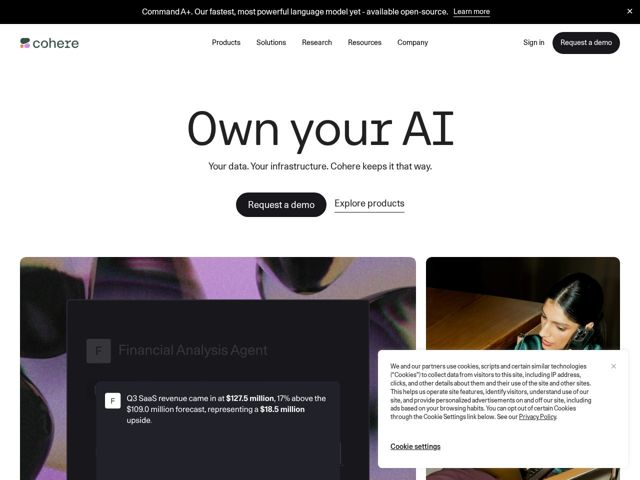

# Cohere — https://cohere.ai

- **niche:** ai
- **mood:** clean-light
- **style:** minimal, photographic
- **palette:** bg `#FAFAF8` · ink `#1A1A1A` · accent `#000000` — Filled black pill CTAs (Request a demo), the black announcement bar at top, and underlined ghost text-links (Explore products); accent is monochrome black rather than a color, with a soft warm off-white canvas doing the lifting
- **type:** display *Cohere Sans / geometric-humanist grotesk (large weight, near-black on body but light/regular weight at hero scale)* · body *Same grotesk family at regular weight (compact line-height, slightly wide tracking)* — Calm, confident, lowercase-friendly grotesk; oversized but thin-stroke headline reads premium and unhurried rather than loud
- **sections:** announcement-bar › hero › feature-product-showcase › logos › problem › feature-sovereign-ai › feature-models › feature-developer-resources › testimonials › cta › footer
- **signature:** The hero is text-only on bare off-white — no graphic — and the product proof lives BELOW it as a pair of editorial photo tiles: a dark UI chat-card (a 'Financial Analysis Agent' generating a real revenue sentence) composited over a grainy lifestyle photo of a person, so the product demo and human context share one frame.
- **imagery:** Hybrid: grainy, desaturated documentary-style photography (real people in muted purple/green ambient light) used as full-bleed tiles, with translucent dark product-UI cards floating on top showing actual model output. Film-grain texture and low contrast give it an editorial, anti-stock-photo feel.
- **copy:** Ownership/sovereignty framing in short declarative fragments — hero reads 'Own your AI' with subhead 'Your data. Your infrastructure. Cohere keeps it that way.'; voice is plain, possessive, enterprise-trust over hype.

**Takeaways (steal as ideas, don't copy):**
- Lead with a text-only hero on bare canvas and defer ALL product/screenshot proof to the section below — lets a 3-word headline breathe and feel premium instead of competing with a UI mockup
- Show the model's actual output verbatim inside the demo card (a full 'Q3 SaaS revenue came in at $127.5M, 17% above forecast' sentence with bolded figures) rather than a fake/blurred UI — concrete numbers sell capability
- Composite a dark translucent product-UI card directly over a grainy human photo so 'the tool' and 'the person using it' occupy one tile — humanizes an abstract AI product without a separate lifestyle section
- Run accent as pure monochrome black (pill CTA + black announcement bar) on warm off-white, and use a single underlined ghost link as the secondary action — restraint signals enterprise seriousness
