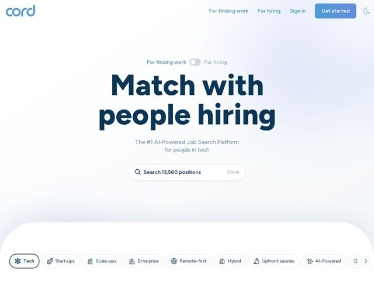

# Cord — https://cord.com

- **niche:** recruiting / job-search platform (tech hiring)
- **mood:** clean-light
- **style:** minimal, gradient, mono-type
- **palette:** bg `#F2F6FB` · ink `#13294B` · accent `#3E7BFA` — logo wordmark, nav 'Get started' CTA pill (blue gradient), 'For finding work' label, search-bar focus, active 'Tech' chip outline
- **type:** display *Geometric grotesque / heavy rounded sans (Gilroy or Poppins ExtraBold lineage)* · body *Humanist sans (same family lighter weight, ~Poppins/Inter)* — Friendly-confident: oversized ultra-bold lowercase headline reads warm and human rather than corporate; tight optical sizing makes the two-line hero the whole stage
- **sections:** nav › hero › mode-toggle › hero-search › category-filter-chips
- **signature:** A binary segmented toggle ('For finding work / For hiring') planted directly above the headline turns the homepage into a two-audience switch instead of forcing a niche or a split landing page — the hero literally rewrites itself for seeker vs employer.
- **imagery:** Near-imageless. No people, no product mockups. The visual language is a soft cool-blue radial gradient wash behind type, plus a tactile floating search field and a horizontally-scrolling row of icon+label filter chips. A rounded-top white 'panel' rises from the bottom suggesting an app surface peeking up.
- **copy:** Plainspoken, human-first promise over jargon — hero: 'Match with people hiring', subhead 'The #1 AI-Powered Job Search Platform for people in tech'.

**Takeaways (steal as ideas, don't copy):**
- Lead with a search box, not a 'Sign up' wall — a live count ('Search 13,560 positions') plus a Ctrl+K hint frames the whole product as a fast tool and proves marketplace liquidity instantly.
- Use a single audience toggle above the fold to serve two opposite users from one hero instead of building separate landing pages.
- Let one giant ultra-bold lowercase headline carry the entire viewport — no imagery needed when the type is the hero.
- Turn taxonomy into a scannable, scrollable chip rail (Tech, Start-ups, Remote-first, AI-Powered) with tiny icons to telegraph breadth and invite exploration right under the fold.
