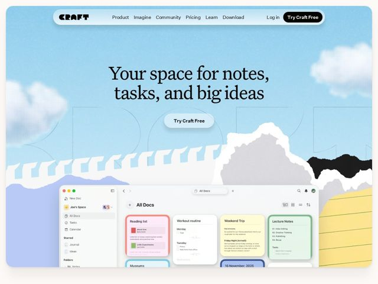

# Craft — https://craft.do

- **niche:** productivity
- **mood:** warm-playful
- **style:** illustrated, colorful
- **palette:** bg `#A9D4F0` · ink `#1C1C1E` · accent `#0A0A0A` — CTAs em pílula preta ('Try Craft Free') e o logotipo/nav; os acentos coloridos vivem dentro dos cards do produto (abas coral, menta, manteiga, lavanda) em vez do chrome
- **type:** display *Um serif Didone de alto contraste (estilo Tiempos/Canela) no H1 — hastes finíssimas, serifas com bracketing afiado* · body *Um sans geométrico/grotesque limpo (tipo Inter) para nav, botões e rótulos de UI* — Editorial encontra amigável: o título serifado literário traz calor e capricho, o sans o mantém moderno e com cara de app; o logotipo CRAFT robusto e arredondado adiciona a nota brincalhona
- **sections:** hero › feature-versatility › how-it-works › feature-integrations › feature-planning › cta › footer
- **signature:** A hero inteira é um diorama em camadas de papel recortado — um céu de papel cartão azul-claro com nuvens texturizadas, cordilheiras rasgadas e a borda de uma página de caderno — onde a janela real do app se encaixa, de modo que o produto parece viver dentro de uma cena feita à mão em vez de flutuar sobre um gradiente.
- **imagery:** Uma "paisagem de papel" em colagem: nuvens de papel recortado, montanhas de papel rasgado e a borda de um bloco amarelo construídos numa cena de céu, com uma janela realista de captura de tela do produto (cards de nota) encaixada no primeiro plano como se estivesse sobre uma mesa naquele mundo.
- **copy:** Conduzida por benefício, direta. A hero literalmente diz "Your space for notes, tasks, and big ideas" — calorosa e humana, sem jargão; os títulos de seção têm personalidade ("Planning that doesn't feel like work", "Craft isn't just for one thing, it's for your things").

**Takeaways (roube como ideias, não copie):**
- Combine um título serifado Didone de alto contraste com um corpo em sans geométrico neutro — o serif carrega todo o 'capricho/calor' para que o resto da UI possa ficar simples.
- Mantenha o chrome monocromático (pílulas pretas, logotipo preto sobre um único campo azul-céu chapado) e deixe TODA a cor vir de dentro dos cards de nota coloridos da captura de tela do produto — o app fornece o 'colorido', não a página.
- Construa a hero como um diorama tátil de colagem de papel (nuvens recortadas, montanhas rasgadas, borda de bloco) e assente a janela do produto nele, em vez do padrão captura-sobre-gradiente.
- Dê a cada seção de feature um título humano e anti-corporativo como 'Planning that doesn't feel like work' em vez de um substantivo de feature.
