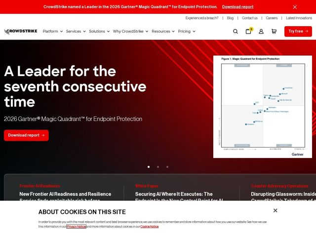

# Crowdstrike — https://crowdstrike.com

- **niche:** security
- **mood:** technical-dark
- **style:** dark, gradient, bold, cinematic
- **palette:** bg `#0A0A0C` · ink `#FFFFFF` · accent `#FC0000` — Banner de alerta no topo, botões CTA primários (Try free / Download report), rótulos eyebrow de seção (Frontier AI Readiness), gradientes diagonais de feixes de luz na hero e hovers de link em estado ativo
- **type:** display *CrowdStrike Sharp Sans (grotesque sob medida)* · body *Neue Haas Grotesk Display Pro* — Projetada, confiante, com precisão de nível militar — tracking largo nos pesos de display, grotescos geométricos-mas-humanistas que soam autoritários sem parecer frios. O Sharp Sans sob medida confere propriedade e uma borda dura, cortante como lâmina, que combina com a marca.
- **sections:** banner › hero › logos › feature-frontier-ai › feature-secure-ai › feature-agentic-soc › recognition-analysts › pricing-bundles › testimonials › how-it-works › cta › footer
- **signature:** A hero encena um gráfico real do Gartner Magic Quadrant — um literal scatter-plot de analista — como a imagem da hero, em vez de uma UI de produto ou render abstrato. A maioria das páginas de segurança enterra a prova de terceiros num muro de logos; a CrowdStrike faz do "nós somos o ponto no canto superior direito" todo o argumento visual da dobra.
- **imagery:** Palcos cinematográficos com gradiente vermelho-escuro para preto e texturas diagonais de laser/feixes de luz cortando a hero, evocando movimento e rastreamento de ameaças. As imagens alternam entre artefatos de dados autoritários (a captura do quadrante do Gartner emoldurada como um documento) e cards editoriais de threat-intel. Quase nenhuma foto de banco de imagens — a linguagem visual é dados-como-hero mais luz atmosférica.
- **copy:** Reivindicações declarativas de autoridade, enquadradas em dominância, que começam pelo ranking e pela retórica antes das features. Hero (carrossel): "A Leader for the seventh consecutive time"; h1 primário: "The Agentic Security Platform. Unified and built to secure the AI revolution."

**Takeaways (roube como ideias, não copie):**
- Transforme a validação de terceiros na própria hero: enquadre um gráfico ou ranking real de analista como a imagem principal da dobra, em vez de escondê-lo numa faixa de confiança mais abaixo.
- Comece o título com uma reivindicação de série contínua ('seventh consecutive time') — longevidade quantificada soa como prova mais sólida do que um adjetivo como 'best'.
- Use um único vermelho de marca saturado contra o quase-preto como ferramenta direcional: reserve-o estritamente para alertas, CTAs e rótulos eyebrow, de modo que todo elemento vermelho comande ação.
- Adicione gradientes diagonais de feixes de luz sobre um palco escuro para sugerir velocidade e vigilância — atmosfera barata que faz uma hero escura e chapada parecer cinética e dentro do tema de segurança.
