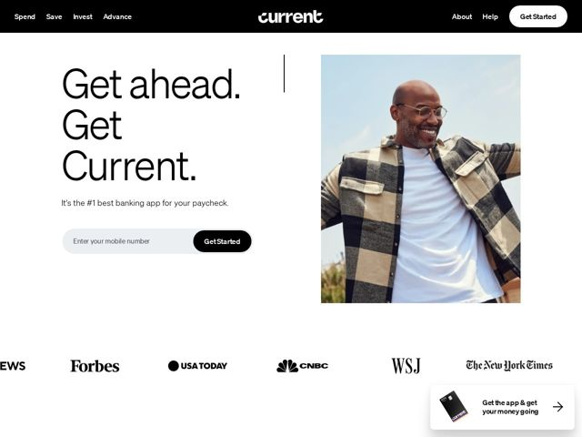

# Current — https://current.com

- **niche:** fintech
- **mood:** clean-light
- **style:** minimal, photographic, editorial
- **palette:** bg `#FFFFFF` · ink `#0A0A0A` · accent `#000000` — black pill CTA buttons (Get Started), black header band, and the black/charcoal Current card in the floating app-download prompt
- **type:** display *Proxima Nova* · body *Proxima Nova* — Friendly humanist geometric sans run at near-poster scale; the same warm rounded sans does both giant headline and small print, giving an approachable, un-corporate, almost consumer-magazine confidence
- **sections:** header-nav › hero › logos › feature-paycheck › feature-credit › social-proof-members › feature-banking-support › feature-savings › feature-crypto › feature-teen-card › feature-security › cta › disclosures › footer
- **signature:** The hero headline is set bigger than the brand wordmark itself and stacked into three short staccato lines ("Get ahead. / Get / Current.") with periods after each fragment — typographic poster confidence on a banking page, where the convention is a chart, a glowing card render, or a dashboard. Words ARE the visual.
- **imagery:** Single full-bleed lifestyle photograph in a soft rounded-corner frame: a real, candid, laughing person outdoors in natural daylight (lens flare, plaid shirt, grass) — aspirational-everyday rather than studio-slick. No card renders, no UI screenshots, no abstract gradients in the hero. A thin vertical hairline rule separates the headline column from the photo. Press logos sit as flat monochrome lockups below.
- **copy:** Imperative, two-beat, almost a chant — punchy verb-first fragments. Hero: "Get ahead. Get Current." with subline "It's the #1 best banking app for your paycheck."

**Takeaways (steal as ideas, don't copy):**
- Set the hero headline LARGER than the logo and break it into 2-3 terse periods-as-full-stops fragments so the copy itself becomes the hero graphic — no product render needed.
- Use one warm humanist sans (Proxima Nova) at every scale, from billboard headline to legal disclosures, instead of pairing fonts — radical typographic restraint reads as confidence.
- Replace the obligatory fintech card-render with a single sun-lit candid lifestyle photo in a rounded frame to sell a feeling (freedom, getting ahead) over a feature.
- Use fully-black pill buttons and a black nav band as the only 'accent' on an all-white page — let one ink color do all the work so the photo carries the warmth.
